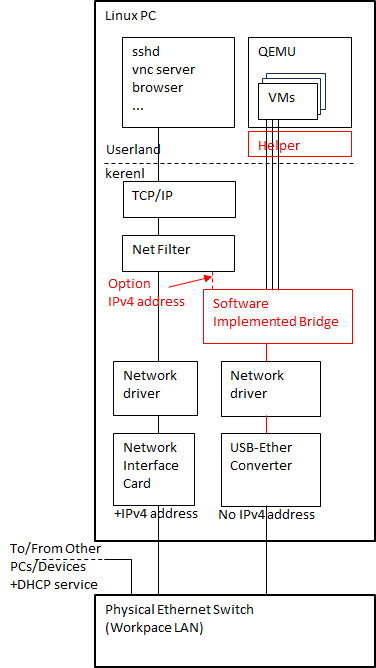
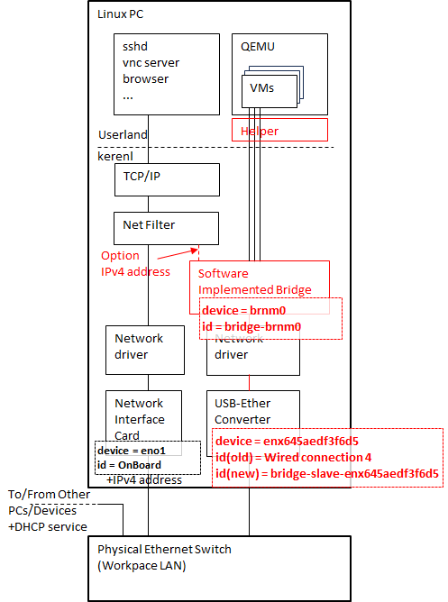
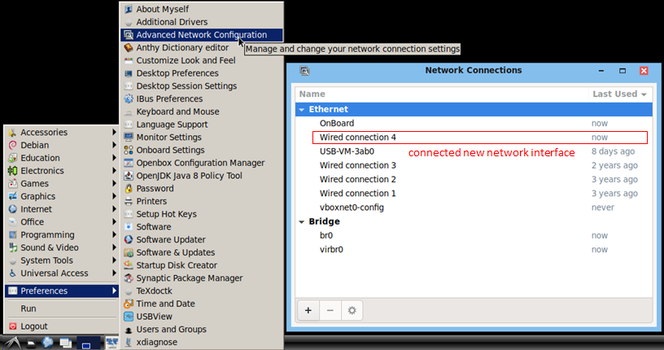
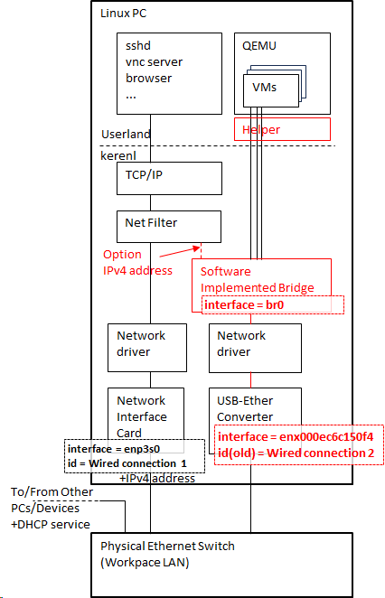

# Configure Network Bridge for QEMU

## Introduction

This page shows how to configure a bridge network
to access external LAN directory from a QEMU emulated machines
on the Linux.

Here assuming following environment.

+ Linux PC
  + Ubuntu or distributions compatible with the Ubuntu.
    + Release 24.04 or later.
  + At least one of following services is enabled,
    + NetworkManager service
    + networking service
      + Using traditional /etc/network/*
        configuration files.
+ Two or more network interfaces
  + One for ssh and various connection services
    from/to remote system.
  + One for bridge shared with QEMU emulators.
    + The "bridge" is software implemented L2
      switch in Linux kernel network stack.
+ DHCP server(s) on LAN.
  + A DHCP client can obtain a IPv4 address
    from the DHCP server.

Following figure shows the network to configure
and use from virtual machines on QEMU
(some details are simplified).



The parts written in red at above picture
will be configured.

+ The box "Software Implemented Bridge"
  + Setup a network bridge in the Linux kernel
    + Use the `nmcli` (NetworkManager Command Line
      Interface)
    + Or modify files under /etc/network to
      configure the "networking service"
+ The box "Helper"
  + Configure QEMU network helper
    + Allow QEMU to configure bridge device
      in the Linux kernel network stack by
      /etc/qemu/bridge.conf
    + Set "setuid" bit to qemu-bridge-helper

## References

+ [Introduction to Linux interfaces for virtual networking](https://developers.redhat.com/blog/2018/10/22/introduction-to-linux-interfaces-for-virtual-networking)
+ [Arch Linux Network bridge](https://wiki.archlinux.org/title/Network_bridge)
+ [debian NetworkConfiguration](https://wiki.debian.org/NetworkConfiguration)
+ [NetworkManager Reference Manual](https://networkmanager.dev/docs/api/latest/)
  + [manpage nmcli(1)](https://manpages.org/nmcli)
    + [manpage nmcli-examples(7)](https://manpages.org/nmcli-examples/7)
+ [manpage interfaces(5)](https://manpages.debian.org/bookworm/ifupdown/interfaces.5.en.html)
  + [manpage BRIDGE-UTILS-INTERFACES(5)](https://manpages.debian.org/testing/bridge-utils/bridge-utils-interfaces.5.en.html)
  + [manpage ifdown(8) ifdown(8)](https://manpages.debian.org/bookworm/ifupdown2/ifup.8.en.html)
+ [QEMU User Documentation](https://www.qemu.org/docs/master/system/qemu-manpage.html)
  + [QEMU Networking](https://wiki.qemu.org/Documentation/Networking)
  + [QEMU Helper Networking](https://wiki.qemu.org/Features/HelperNetworking)

## Setup network bridge by nmcli

### Test nmcli availability

In this section, setup "Software Implemented Bridge"
(hereafter Bridge) in the Linux kernel network stack by
[nmcli (Network Manager Command Line Interface)](https://manpages.org/nmcli).

> [!TIP]
> If you prefer traditional UNIX interface files under
> /etc/network, [Use networking service instead of nmcli](#Use-networking-service-instead-of-nmcli)

First, test `nmcli` command is available.

```bash
nmcli
```

> [!TIP]
> If you are using old `nmcli`, you'll get simply
> help message. To show network connection,
> type `nmcli dev show`.

If you got some network connection and states as follows,
you can use the `nmcli` command.

> [!NOTE]
> Some parts of outputs are omitted.

```text
eno1: connected to OnBoard
        "Realtek RTL8111/8168/8411"
        ethernet (r8169), 1C:1B:0D:9B:24:BC, hw, mtu 1500
        ip4 default, ip6 default
        inet4 192.168.0.16/24
        route4 0.0.0.0/0
        route4 192.168.0.0/24
        inet6 240f:6e:7f7:1:b0b3:74d1:e60e:9ee1/64
        inet6 fe80::d511:3dcf:ed8:8088/64
        route6 240f:6e:7f7:1::/64
        route6 ::/0
        route6 fe80::/64

lo: connected (externally) to lo
        "lo"
        loopback (unknown), 00:00:00:00:00:00, sw, mtu 65536
        inet4 127.0.0.1/8
        inet6 ::1/128

enx645aedf3f6d5: connected to Wired connection 4
        "Apple A1277"
        ethernet (asix), 64:5A:ED:F3:F6:D5, hw, mtu 1500
        inet4 192.168.0.52/24
        route4 0.0.0.0/0
        route4 192.168.0.0/24
        inet6 240f:6e:7f7:1:594d:6835:31fe:5f3e/64
        inet6 240f:6e:7f7:1:9b27:446d:5b87:9a75/64
        inet6 fe80::150:d018:502d:1063/64
        route6 240f:6e:7f7:1::/64
        route6 ::/0
        route6 fe80::/64
~~~ snip ~~~
```

If you are accessing server from remote, it's better to
take notes of IP addresses got here. These addresses helps
you when reconnecting ssh to server after some network failures.

If `nmcli` command isn't available or fails with some
error like following output,
it's better to [modify files under /etc/network and configure networking service](#use-networking-service-instead-of-nmcli).

```text
Error: NetworkManager is not running.
```

### Get network configurations by nmcli

Prepare a USB (Plug and Play extension) or
PCIe(Some extension card fixing inside machine case)
Network Interface dedicated to QEUM virtual machines.

> [!NOTE]
> Can I use a WiFi Network Interface as a bridge-slave (with a Bridge)?
>
> For most cases, No.
>
> You can't configure a WiFi Network Interfaces
> as a bridge-slave. Read following pages to know more details,
> + [Routing the IP packets from the station (STA) to another node that's connected over USB/ethernet](https://superuser.com/questions/1660278/routing-the-ip-packets-from-the-station-sta-to-another-node-thats-connected-o)
>   + MAC addressing restrictions about WiFi structure.
> + [Wireless-to-Ethernet network bridging](https://docs.digi.com/resources/documentation/digidocs/embedded/dey/2.4/cc6ul/bsp_r_wifi-network-bridging_hostapd)
>   + Using a Interface which supports "Access Point" mode.
> + [How to create wireless bridge connection with nmcli](https://unix.stackexchange.com/questions/219887/how-to-create-wireless-bridge-connection-with-nmcli)
> + [Chapter 9. Configure Network Bridging](https://docs.redhat.com/en/documentation/Red_Hat_Enterprise_Linux/7/html/Networking_Guide/ch-Configure_Network_Bridging.html)
>   + Read paragraph "Note that a bridge cannot be established over Wi-Fi networks operating in Ad-Hoc or Infrastructure modes..."

#### Use a USB (Plug and Play extension) network interface

If you will access the QEMU host from remote during
following procedures, establish remote login now.

Connect a USB (PnP extension) Network Interface to
machine.

Type `nmcli` command, take a notes of Network Interfaces.

```bash
# Get Network Interfaces by nmcli
nmcli
eno1: connected to OnBoard
        "Realtek RTL8111/8168/8411"
        ethernet (r8169), 1C:1B:0D:9B:24:BC, hw, mtu 1500
        ip4 default, ip6 default
        inet4 192.168.0.16/24
        route4 0.0.0.0/0
        route4 192.168.0.0/24
        inet6 240f:6e:7f7:1:b0b3:74d1:e60e:9ee1/64
        inet6 fe80::d511:3dcf:ed8:8088/64
        route6 240f:6e:7f7:1::/64
        route6 ::/0
        route6 fe80::/64
~~~ snip ~~~
enx645aedf3f6d5: connected to Wired connection 4
        "Apple A1277"
        ethernet (asix), 64:5A:ED:F3:F6:D5, hw, mtu 1500
        inet4 192.168.0.52/24
        route4 0.0.0.0/0
        route4 192.168.0.0/24
        inet6 240f:6e:7f7:1:594d:6835:31fe:5f3e/64
        inet6 240f:6e:7f7:1:9b27:446d:5b87:9a75/64
        inet6 fe80::150:d018:502d:1063/64
        route6 240f:6e:7f7:1::/64
        route6 ::/0
        route6 fe80::/64
~~~ snip ~~~
```

At above example shows the USB Network Interface as,

|Item|Value|
|---|---|
|_InterfaceName_|`enx645aedf3f6d5`|
|_ConnectionID_|"`Wired connection 4`"|

#### Use a PCIe (Fixed in a box extension) network interface

Fix in PCIe (Card in a box extension) Network Interface
to your machine. And turn on your machine, login, and
start terminal and operation.

Type `nmcli` command, take a notes of Network Interfaces.

```text
# Get Network Interfaces by nmcli
nmcli
enp5s0: connected to Wired connection 3
        "Broadcom and subsidiaries NetXtreme BCM5722"
        ethernet (tg3), 00:10:18:73:4D:5A, hw, mtu 1500
        ip4 default, ip6 default
        inet4 192.168.0.242/24
        route4 192.168.0.0/24 metric 101
        route4 default via 192.168.0.1 metric 101
        inet6 240f:6e:7f7:1:7bf:a582:7d46:8275/64
        inet6 240f:6e:7f7:1:ced2:f47f:42ae:6ab2/64
        inet6 fe80::f41:11a4:83de:babe/64
        route6 fe80::/64 metric 1024
        route6 240f:6e:7f7:1::/64 metric 101
        route6 default via fe80::9af1:99ff:fee2:7334 metric 101

enp4s0: connected to Wired connection 1
        "Realtek RTL8111/8168/8411"
        ethernet (r8169), 24:4B:FE:94:1C:A4, hw, mtu 1500
        inet4 192.168.0.99/24
        route4 192.168.0.0/24 metric 102
        route4 default via 192.168.0.1 metric 102
        inet6 240f:6e:7f7:1:8a10:c38d:e7cd:e1c4/64
        inet6 240f:6e:7f7:1:19e2:de98:21af:7e71/64
        inet6 fe80::9070:45cb:3737:672d/64
        route6 fe80::/64 metric 1024
        route6 240f:6e:7f7:1::/64 metric 102
        route6 default via fe80::9af1:99ff:fee2:7334 metric 102
```

At above example shows the PCIe Network Interface
as follows,

#### enp5s0 (Dedicated to QEMU emulator)

The device enp5s0 will be modified by `nmcli` command.

|Item|Value|
|---|---|
|_InterfaceName_|`enp5s0`|
|_ConnectionID_|"`Wired connection 3`"|

#### enp4s0 (Access from/to remote machine)

The device Will not be modified by `nmcli` command.
Nothing will be changed.

|Item|Value|
|---|---|
|InterfaceName|`enp4s0`|
|ConnectionID|"`Wired connection 1`"|

If you will access the QEMU host from remote during
following procedures, establish one or more new shell
connection to `enp4s0`. Keep lifeline over `enp4s0`.
For example (it follows above outputs),

```bash
# Add new shell connection to enp4s0 over IPv4
ssh YourUserName@192.168.0.99
# or add new shell connection to enp4s0 over IPv6
ssh YourUserName@[fe80::9070:45cb:3737:672d]
```

Here shows procedure that using USB Network Interface
{`enx645aedf3f6d5`, "`Wired connection 4`"}.
The following figure shows _InterfaceName_(device), and
_ConnectionID_(id) in a Linux PC.



To see Network Interface configurations by GUI,
click **Start Icon** → **Preferences** → **Advanced Network Configuration** as following figure shows.



A new Network Interface is configured by automatically
generated connection named similar to "`Wired connection` _N_".

> [!NOTE]
> Some times the Network Manager doesn't configure
> a new Network Interface, but I don't know why.

> [!TIP]
> The "Connection name" is called something else by
> various tools.
> The following table shows how "Connection name" is
> called by various tools.
>
> |tool|representation|
> |----|--------------|
> |GUI (Advanced Network Configuration)|Name \| Connection name|
> |nmcli (man page)|id \| ID \| con-name|
> |nmcli conn show (list style)|NAME|
> |nmcli conn show \| edit \| modify (detail style)|connection.id|
>
> I think the manuals, documents and outputs about
> Network Manger aren't well polished.

Also show the connection settings.

```bash
nmcli conn show
```

The following output example shows new connection
`"Wired connection 4"`. It's a USB Network Interface
(dedicated to QEMU virtual machines).

> [!NOTE]
> Some outputs are snipped.

```text
NAME                UUID                                  TYPE      DEVICE          
OnBoard             3b9ac036-3955-3430-89d0-d38652ff22a7  ethernet  eno1            
Wired connection 4  bc3b61cc-7829-3569-be68-36a189e06de9  ethernet  enx645aedf3f6d5
-- snip --
# Ignore outputs colored by dark green.
```

> [!TIP]
> Some outputs are colored with
> <span style="color: darkgreen">dark green</span>.
> They are not managed by "Network Manager".

> [!NOTE]
> If Network Manager doesn't configure a USB Network Interface,
> there is no connection named like "`Wired connection 4`"
> which configures the interface.
> So you don't need remove connection "`Wired connection 4`"
> by `sudo nmcli conn delete "Wired connection 4"`.

After here, use following identifiers shown in following table.
They will be read as your environment and replaced with other
symbols to avoid conflict.

|identifier string|object class|description|
|------------------|--------------------|-----------|
|`Wired connection 4`|Connection name (id)|The name of configuration applied to USB Network Interface `enx645aedf3f6d5` by the Network Manager. The name is automatically generated.|
|`enx645aedf3f6d5`|device or ifname|The device (interface) name of USB Network Interface. If a Network Interface is PICe cards, which name is `eth`_N_, `eno`_N_, or `enp`_N_`s`_M_ and so on.|
|`brnm0`|device (Bridge)|The name of Software Implemented Bridge in the Linux Kernel. You can name it as you like. Here, use name like `brnm0`, it represents br("Bridge"), configured by nm("Network Manger"), numbered 0.|
|`bridge-brnm0`|Connection name (id)|The name of configuration applied to Bridge `brnm0`. The `nmcli` command generates this name. Add prefix "`bridge-`" to "`brnm0`".|
|`bridge-slave-enx645aedf3f6d5`|Connection name (id)|The name of configuration which represents relation USB Network Interface  `enx645aedf3f6d5` to Bridge `brnm0`. The USB Network Interface is called as slave. The Bridge is called as master. The nmcli command generates this name. Add prefix "`bridge-slave-`" to "`brnm0`".|
|`eno1`|device or ifname|This device (interface) won't be modified. Use this to connect from/to host machine. Use parallel with `enx645aedf3f6d5`|
|`OnBoard`|Connection name (id)|The name of configuration applied to `eno1`. This device (interface) won't be modified.|

> [!TIP]
> The Network Manager treats devices and connections
> (configurations) are individual contexts. They are
> identical and have unique name each other.

### Configure a Bridge by nmcli

Add a Bridge to connections and create relation to a device.

```bash
# Add the Bridge brnm0,
#  Create bridge-brnm0 connection.
sudo nmcli conn add type bridge ifname brnm0
# Disable spanning tree protocol in brnm0.
sudo nmcli conn modify bridge-brnm0 bridge.stp no
# Configure network device enx645aedf3f6d5 as bridge-slave,
#  Create bridge-slave-enx645aedf3f6d5 connection.
sudo nmcli conn add type bridge-slave ifname enx645aedf3f6d5 master bridge-brnm0
# Disable DHCP IPv4 configuration on connection bridge-brnm0 (applies to brnm0)
sudo nmcli conn modify bridge-brnm0 ipv4.method disabled
```

### Recover nmcli error connection: Message recipient disconnected from message bus without replying

When `nmcil` command failed with following message (or similar one),
`nmcli` command didn't complete setting operation.

```text
Error: Failed to add 'bridge-brnm0' connection: Message recipient disconnected from message bus without replying
```

When you see a `nmcli` error, immediately start recover
operation by following commands. Complete operation
and finalize settings to Network Manger state.

```bash
# Recover "Message recipient disconnected from message bus without replying"
#  Sync systemd states with services keeping system.
sudo systemctl daemon-reload
#  Restart NetworkManager.
sudo systemctl restart NetworkManager
#  Wait NetworkManager becomes online and reload network connection.
sudo nm-online && sudo nmcli conn reload
#  See settings are stored correctly.
nmcli conn show
```

But still you can't recover a `nmcli` error, run additional
commands as follows.

```bash
# Recover "Message recipient disconnected from message bus without replying",
#  using dpkg-reconfigure
sudo dpkg-reconfigure network-manager
#  See settings are stored correctly.
nmcli conn show
```

> [!WARNING]
> If you see an error
> `Message recipient disconnected from message bus without replying`,
> don't retry command which causes an error.
>
> If you retry command and get same errors again and again,
> Broken settings are stored under `/etc/netplan/*`,
> and they cause unexpected results.
>
> + Do recovery operation.
> + See `nmcli conn show` output.
> + Remove connection by `sudo conn delete` _connection-name_
>
> Still you can't recover from abnormal condition, remove
> setting files as follows,
>
> + Read files under `/etc/netplan/*`
>   + Only root can read these files.
>   + They are formatted yaml-style.
> + Find out files they have same "name" key.
>   + A "name" key example: `name: "bridge-brnm0"`
> + Remove the files found at above.
>
> If you are using old Network Manager, network settings are
> stored files under `/etc/NetworkManager/system-connections/*`.
> These files are formatted INI-style. Find files they
> have same "name" and remove them.
>
> I think that systemd and Network Manger are too complicated
> due to using dbus (Inter Process Communication).
> They are responsible to important system behavior, but
> they can't complete `nmcli` commands certainly.

Following table shows properties `bridge.stp` and `ipv4.method` to `bridge-brnm0`.

|setting property|value|description|
|----------------|-----|-----------|
|`bridge.stp`|`no`|Disable STP (Spanning Tree Protocol) at the Bridge `brnm0`. The STP avoids packet looping storm in loop topology hopping bridges. The STP detects loop topology and logically opens loop topology (topology becomes tree). There is no complicated topology around the Bridge `brnm0`. Here, choose `no` to this option.|
|`ipv4.method`|`disabled`|To use Bridge `brnm0` and slave device `enx645aedf3f6d5` dedicated to QEMU virtual machines. The host machine network services (for example, sshd, smbd, and so on.) don't establish connection from/to remote via device `enx645aedf3f6d5`. [See pros and cons](#assign-ip-address-to-bridge-pros-and-cons).|

Check configurations by `nmcli`.

```bash
nmcli conn show
```

Following output example shows connections `bridge-brnm0` and `bridge-slave-enx645aedf3f6d5`.

```text
NAME                          UUID                                  TYPE      DEVICE          
OnBoard                       3b9ac036-3955-3430-89d0-d38652ff22a7  ethernet  eno1            
Wired connection 4            bc3b61cc-7829-3569-be68-36a189e06de9  ethernet  enx645aedf3f6d5 
bridge-brnm0                  3a2e41a1-831b-4294-8885-a8184d161d23  bridge    brnm0           
bridge-slave-enx645aedf3f6d5  cf78f701-4cf8-4a5a-931e-6bd9bc7e158a  ethernet  enx645aedf3f6d5
-- snip --
```

Following table shows relations connections and devices.

|connection name (NAME)|device (DEVICE)|
|-----------------------|---------------|
|bridge-brnm0|brnm0|
|bridge-slave-enx645aedf3f6d5|enx645aedf3f6d5|

Delete the connection "`Wired connection 4`". If connection "`Wired connection 4`" remains, it conflicts with connection `bridge-slave-enx645aedf3f6d5` at device `enx645aedf3f6d5`.

```bash
# Delete connection "Wired connection 4", "Wired connection 4" is replaced with "bridge-slave-enx645aedf3f6d5"
sudo nmcli conn delete "Wired connection 4"
```

Confirm settings.

```bash
nmcli conn show
```

You'll get output similar to following text, the connection
"`Wired connection 4`" removed away.

```text
NAME                          UUID                                  TYPE      DEVICE          
OnBoard                       3b9ac036-3955-3430-89d0-d38652ff22a7  ethernet  eno1            
bridge-brnm0                  3a2e41a1-831b-4294-8885-a8184d161d23  bridge    brnm0           
bridge-slave-enx645aedf3f6d5  cf78f701-4cf8-4a5a-931e-6bd9bc7e158a  ethernet  enx645aedf3f6d5 
```

To see all properties at connection, use `nmcli conn show` _connection-name_
as follows.

```bash
nmcli conn show bridge-brnm0
nmcli conn show bridge-slave-enx645aedf3f6d5
```

Next two links show properties at connection collected from real machine.
Compare with your connection.

+ [nmcli conn show nmbr0](../snippets/nmcli-conn-show-nmbr0.txt)
+ [nmcli conn show bridge-slave-enx645aedf3f6d5](../snippets/nmcli-conn-show-bridge-slave-enx645aedf3f6d5.txt)

Properties named by character \[a-z.-\] like `connection.id`,
they are configured with `nmcli` command.

Properties named by character \[A-Z.-\], they are dynamically updated.

Activate connection `bridge-brnm0` and `bridge-slave-enx645aedf3f6d5` settings. If you are operating from remote, you may loose connection.
If you loose a connection, connect again referring IP addresses
noted at [Get network configurations by nmcli](#get-network-configurations-by-nmcli).

```bash
# To reconfigure device brnm0, down and up device brnm0.
sudo nmcli conn down bridge-brnm0; sleep 1; sudo nmcli conn up bridge-brnm0
# Remove IP address configuration from device enx645aedf3f6d5.
#  It may disconnect remote login session.
sudo nmcli conn down bridge-slave-enx645aedf3f6d5; sleep 1; sudo nmcli conn up bridge-slave-enx645aedf3f6d5
```

> [!TIP]
> To delete a connection, use,
>
>> `sudo nmcli conn delete` _connection-name_
>
> It helps when you think something wrong in Network Manager settings.
>
> To fix a part of connection settings, use,
>
>> `sudo nmcli conn edit` _connection-name_
>
> You can use "`help` _property_" and "`describe` _property_"
> command in interactive session.
>
> Settings are stored under "`/etc/netplan/*`" or
> "`/etc/NetworkManager/system-connections/*`".
> They could be read from root account.

All settings updated and added here are saved, and applied after reboot.

## Setup QEMU Bridge helper

To manipulate a Bridge in the Linux Kernel, it requires root privilege.
Without any helpers, connecting a Bridge to QEMU virtual machine,
run qemu emulator as root privilege.
The QEMU package `qemu-system-common` offers `qemu-bridge-helper`
tool to use a Bridge from non privileged user
(QEMU emulator application). To see more details read
an article [QEMU wiki Features/HelperNetworking](https://wiki.qemu.org/Features/HelperNetworking).

### Install qemu-bridge-helper

Install `qemu-bridge-helper`, run following command. It may be
already installed when installing the QEMU package and required packages.

```bash
sudo apt install qemu-system-common
```

Search where `qemu-bridge-helper` is installed, run
"`dpkg-query -S` _ToFind_".

```bash
dpkg-query -S qemu-bridge-helper
```

You may get path to `qemu-bridge-helper` as following output,

```text
qemu-system-common: /usr/lib/qemu/qemu-bridge-helper
```

If you get path other than `/usr/lib/qemu/qemu-bridge-helper`,
you read it as what you get exactly.

### Configure Bridge device to manipulate by qemu-bridge-helper

Specify a Bridge device using from QEMU emulator in
`/etc/qemu/bridge.conf`. The bridge.conf file allows QEMU emulator
(with qemu-bridge-helper) to manipulate Bridges.

```bash
# Create /etc/qemu directory, it may not be created at first time.
sudo mkdir -p /etc/qemu
# Edit bridge.conf
sudo nano /etc/qemu/bridge.conf
```

Add an "`allow` _BridgeDevice_" line to file `/etc/qemu/bridge.conf`
like following example.

```text
allow brnm0
```

### Create qemu-bridge-helper executable file with setuid bit

Copy `/usr/lib/qemu/qemu-bridge-helper` to
`/usr/lib/qemu/qemu-bridge-helper-suid` and set mode bit setuid.

> [!NOTE]
> Theres is a [discussion (bug report and answer)](https://bugs.launchpad.net/ubuntu/+source/qemu/+bug/1882420) that is a good or bad idea
> adding setuid bit to `qemu-bridge-helper` owned by root.
> It may causes security risk.
>
> Some people suggest using apparmor (SELinux feature) to
> `qemu-bridge-helper`.
>
> But apparmor doesn't work well.
> In the Linux kernel, function [tun_not_capable()](https://elixir.bootlin.com/linux/v6.8/source/drivers/net/tun.c#L577) called from
> [tun_set_iff()](https://elixir.bootlin.com/linux/v6.8/source/drivers/net/tun.c#L2742) handles [ioctl TUNSETIFF](https://elixir.bootlin.com/linux/v6.8/C/ident/TUNSETIFF).
> The function checks user-land context having enough
> privilege [capability net_admin (CAP_NET_ADMIN)](https://elixir.bootlin.com/linux/v6.8/source/include/uapi/linux/capability.h#L204).
> But it is needed more privilege checking (I didn't investigate
> more details).
>
> To avoid simple script attacks, and to keep less impact to
> other QEMU applications. Keep `qemu-bridge-helper` and
> copy it to `qemu-bridge-helper-suid` adding setuid.

Change directory to `/lib/usr/qemu` which contains
`qemu-bridge-helper`. Copy it, change its mode `+s`.

``` bash
# Change work directory to having qemu-bridge-helper
cd /usr/lib/qemu
# Check if qemu-bridge-helper exists
ls -la
```

You can find `qemu-bridge-helper` as following output.

```text
total NNNN # NNNN is the number of usage bytes of this directory.
drwxr-xr-x   2 root root   4096 Jan 26 03:18 .
drwxr-xr-x 148 root root   4096 Jan 26 00:18 ..
-rwxr-xr-x   1 root root 687280 Dec 12 12:06 qemu-bridge-helper
-rwxr-xr-x   1 root root 789968 Dec 12 12:06 vhost-user-gpu
-rwxr-xr-x   1 root root 703664 Dec 12 12:06 virtfs-proxy-helper
```

Copy and chmod `qemu-bridge-helper`.

```bash
# Copy
sudo cp -p qemu-bridge-helper qemu-bridge-helper-suid
# Set UID bit
sudo chmod u+s qemu-bridge-helper-suid
# Check qemu-bridge-helper-suid permissions,
#  It should be seen -rwsr-xr-x.
ls -la
```

Check the file `qemu-bridge-helper-suid` mode is `-rwsr-xr-x`.

```text
total NNNN
drwxr-xr-x   2 root root   4096 Jan 26 03:18 .
drwxr-xr-x 148 root root   4096 Jan 26 00:18 ..
-rwxr-xr-x   1 root root 687280 Dec 12 12:06 qemu-bridge-helper
-rwsr-xr-x   1 root root 687280 Dec 12 12:06 qemu-bridge-helper-suid
-rwxr-xr-x   1 root root 789968 Dec 12 12:06 vhost-user-gpu
-rwxr-xr-x   1 root root 703664 Dec 12 12:06 virtfs-proxy-helper
```

### Using qemu-bridge-helper-suid

Following script shows how to use `qemu-bridge-helper-suid` from
`qemu-system-arm` which emulates Raspberry Pi 2B virtual machine.

```bash
#!/bin/bash
# Boot Virtual Raspberry Pi 2B with Raspberrypi OS 32bit image.

qemu-system-arm \
-machine raspi2b \
-kernel bootfs/kernel7.img \
-dtb bootfs/bcm2709-rpi-2-b.dtb \
-drive format=raw,file=rpi2vm32-3.img \
-append "console=ttyAMA0,115200 console=tty1 root=/dev/mmcblk0p2 rootfstype=ext4 fsck.repair=yes rootwait dwc_otg.fiq_fsm_enable=0 bcm2708_fb.fbwidth=1024 bcm2708_fb.fbheight=768" \
-serial mon:stdio \
-no-reboot \
-device usb-kbd \
-device usb-tablet \
-netdev tap,br=brnm0,helper=/usr/lib/qemu/qemu-bridge-helper-suid,id=net0 \
-device usb-net,netdev=net0,mac=40:54:00:52:20:03 \
-vnc :12 \
"$@"
```

The network setting part in the above script is following command option.

```text
-netdev tap,br=brnm0,helper=/usr/lib/qemu/qemu-bridge-helper-suid,id=net0 \
-device usb-net,netdev=net0,mac=40:54:00:52:20:03 \
```

The `-netdevice` option specifies,

+ Use TAP (network traffic tap, or a Bridge in the Linux Kernel)
  networking method.
  + While running `qemu-system-arm`, you will see `tap`_N_
    device in the Linux Kernel networking.
  + A bridge act as a L2 ethernet hub, packets are
    passing through between bridge-slave and `tap`_N_.
+ Use the bridge device `brnm0`.
+ Run the helper `/usr/lib/qemu/qemu-bridge-helper-suid`
+ Assign Id `net0`, specify relation to a device.

The `-device` option specifies,

+ Use a emulated USB-Ether device
+ Assign netdeivce Id `net0` (specified above)
+ Set MAC address `40:54:00:52:20:03`

## (Optional) Assign IPv4 address to Bridge by nmcli

It's optional that assgining IP address to the Bridge `brnm0`.
So skip this section if you aren't intended to
access host machine via a Bridge.
Assume that your network maintained by DHCP server.

### Assign IP address to Bridge pros and cons

Comparing assign or not assgin IP address to a Bridge.

+ Doesn't assign IP address to a Bridge (set ipv4.method disabled,
  use two Network Interface, one for host machine, another one for
  QEMU virtual machines)
  + Pros
    + Changing Bridge configuration doesn't affect connection from/to
      host machine network services.
    + Traffics from/to virtual machines and traffics from/to host machine
      are independent each other.
      + Heavy traffics doesn't affect each other.
      + Network connections, band width, and turn around times are stable.
    + Various kind of Network Interfaces suite for virtual machines.
      + Can use a slow and fast speed interfaces.
      + Can use a USB or PCI (directory connected native bus) interfaces.
  + Cons
    + Need a physical Network Interface dedicated to QEMU virtual machines.
+ Assign IP address to a Bridge (set ipv4.method auto or manual,
  connection from/to host services and connection from/to virtual
  machines shares same Network Interface)
  + Pros
    + Share one Network Interface between host and virtual machine,
      no more hardware needed.
  + Cons
    + When accidentaly operation on the Bridge is failed, you may lose
      accessing way to host machine from remotes.
    + Merged traffics host and virtual machines and they affects each other.
      + Need large traffic speed and capaciy on connected hub port.
      + Transfer speed get down.
      + Turn around time get more longer.
      + Connection becomes unstable.

### Assign a Bridge to IP address

To assign a IPv4 address to a Bridge, type following commands,

```bash
# Enable DHCP IPv4 configuration on connection bridge-brnm0 (applies to brnm0)
sudo nmcli conn modify bridge-brnm0 ipv4.method auto
# Sync systemd with NetworkManger
sudo systemctl daemon-reload
# Restart NetworkManager
sudo systemctl restart NetworkManager
# Check configured network devices.
nmcli
```

After avobe operation are done, the host machine has
two addresses on one network segment. You can still
login from/to remotes. You can establish new connection.

## Use networking service instead of nmcli

You can configure a Bridge by placeing files under
`/etc/network/interfaces.d`. The networking service
reads them and configure a Bridge.
You can use the networking serivce with Network Manger.

The following picture shows the network structure
that will be configured.
The interface `enp3s0` is already exsisting and works
connections from/to host machine. It will not be modified.
The interface `enx000ec6c150f4` is the new additional
interface dedicated to QEMU virtual machines.
The `enx000ec6c150f4` will be configured as a software
implimented(in Linux Kernel) Bridge `br0` port.
Which connect to a Workplace(external) LAN hub.



> [!NOTE]
> Here call a network interface hardware as "interface",
> that is an object called "device" by Network Manager.
> Traditional UNIXes (networking service) call a network
> interface hardware as "interface".

The following table shows identifires to describe commands.
You need reread these identfiers with names on your eviromnent
and deserierd names.

|identifier|class|description|
|----------|-----|-----------|
|br0|interface (bridge)|The Bridge name. The Bridge ordered 0.|
|enx000ec6c150f4|interface|The interface name of USB-Ethernet converter dedicated to QEMU virtual machines. A USB-Ethernet interface is named after it's MAC address or named traditional `eth`_N_.|
|Wired connection 2|Connection name (ID)|The connection name applied to the interface `enx000ec6c150f4`, the Network Manager creates this connection.|
|enp3s0|interface|The interface name. The interface `enp3s0` will not be changed, it maintains connection from/to host machile.|
|Wired connection 1|Connection name (ID)|The connection name applied to the interface `enp3s0`. It will not be changed.|

### Install networking service packages

Install networking service and traditional UNIX network tools.

```bash
sudo apt install ifupdown net-tools bridge-utils
```

### Find Network Interface

Find the Netework Interface (here, USB-Ethernet converter),
read kernel log `sudo dmesg`, interfaces `ifconfig -a`, and
`nmcli conn show`.

```bash
# Read dmesg and find messages at probing Network Interface device.
sudo dmesg
# List Network Interfaces.
ifconfig -a
# List NetworkManager settings.
#  When NetworkManager service is not running, you may got an error.
nmcli conn show
```

Find probing log the Netework Interface in `dmesg` output.
The following output shows the Network Interface as
`enx000ec6c150f4`, it MAC address is `00:0e:c6:c1:50:f4`,

```text
[176173.674545] usb 1-1.5: new high-speed USB device number 5 using ehci-pci
[176173.768162] usb 1-1.5: New USB device found, idVendor=0b95, idProduct=7720, bcdDevice= 0.01
[176173.768170] usb 1-1.5: New USB device strings: Mfr=1, Product=2, SerialNumber=3
[176173.768183] usb 1-1.5: Product: AX88x72A
[176173.768186] usb 1-1.5: Manufacturer: ASIX Elec. Corp.
[176173.768189] usb 1-1.5: SerialNumber: 00042C
[176174.326149] asix 1-1.5:1.0 (unnamed net_device) (uninitialized): PHY [usb-001:005:10] driver [Asix Electronics AX88772A] (irq=POLL)
[176174.329514] Asix Electronics AX88772A usb-001:005:10: attached PHY driver (mii_bus:phy_addr=usb-001:005:10, irq=POLL)
[176174.329874] asix 1-1.5:1.0 eth0: register 'asix' at usb-0000:00:1a.0-1.5, ASIX AX88772 USB 2.0 Ethernet, 00:0e:c6:c1:50:f4
[176174.351705] asix 1-1.5:1.0 enx000ec6c150f4: renamed from eth0
[176174.373639] asix 1-1.5:1.0 enx000ec6c150f4: configuring for phy/internal link mode
[176176.489399] asix 1-1.5:1.0 enx000ec6c150f4: Link is Up - 100Mbps/Full - flow control rx/tx
```

> [!TIP]
> If you add a PCIe Network Interface Card, it will be
> probed at Linux Kernel booting.
> To check interface name of it, login after booted
> and run `sudo dmesg`, `cat /var/log/kern.log`,
> or `cat /var/log/syslog`.

Check `ifconfig -a` output. You can find added Network Interface
`enx000ec6c150f4`. The Network Interface may not have a IPv4
address. It isn't a problem.
Take a note IPv4 and IPv6 addresses, these addresses help
you when disconnecting remote access, and reconnect.

```text
enp3s0: flags=4163<UP,BROADCAST,RUNNING,MULTICAST>  mtu 1500
        inet 192.168.0.93  netmask 255.255.255.0  broadcast 192.168.0.255
        inet6 fe80::e760:1c5e:9c3b:63b4  prefixlen 64  scopeid 0x20<link>
        inet6 240f:6e:7f7:1:b15:1cb5:5104:6db2  prefixlen 64  scopeid 0x0<global>
        inet6 240f:6e:7f7:1:2f2c:db1c:b680:9875  prefixlen 64  scopeid 0x0<global>
        inet6 240f:6e:7f7:1:45c2:9d3e:c30f:23b2  prefixlen 64  scopeid 0x0<global>
        ether 50:46:5d:05:49:d6  txqueuelen 1000  (Ethernet)
        RX packets 1553821  bytes 257238249 (257.2 MB)
        RX errors 0  dropped 0  overruns 0  frame 0
        TX packets 451019  bytes 373613710 (373.6 MB)
        TX errors 0  dropped 0 overruns 0  carrier 0  collisions 0
        device interrupt 16  

enx000ec6c150f4: flags=4163<UP,BROADCAST,RUNNING,MULTICAST>  mtu 1500
        inet 192.168.0.67  netmask 255.255.255.0  broadcast 192.168.0.255
        inet6 fe80::c809:1755:160:4f9d  prefixlen 64  scopeid 0x20<link>
        inet6 240f:6e:7f7:1:efbe:8091:1dcc:4fed  prefixlen 64  scopeid 0x0<global>
        inet6 240f:6e:7f7:1:1052:1d7b:de7d:2b12  prefixlen 64  scopeid 0x0<global>
        ether 00:0e:c6:c1:50:f4  txqueuelen 1000  (Ethernet)
        RX packets 3487  bytes 235467 (235.4 KB)
        RX errors 0  dropped 0  overruns 0  frame 0
        TX packets 137  bytes 20337 (20.3 KB)
        TX errors 0  dropped 0 overruns 0  carrier 0  collisions 0
--- snip ---
```

Find connection setting to device `enx000ec6c150f4` from
`nmcli conn show` outout. Following output shows connection
"`Wired connection 2`" applied to device `enx000ec6c150f4`.
A Network Manager connection setting may conflict with
netwoking setting. Here the connection "`Wired connection 2`"
will conflict to networking setting. It will be deleted.

```text
NAME                          UUID                                  TYPE      DEVICE          
Wired connection 1            a12d4fa9-1896-3378-ac37-b7e014fdcc67  ethernet  enp3s0          
Wired connection 2            9190e4b6-3887-4a69-8943-8e642b408968  ethernet  enx000ec6c150f4 
-- snip --
# ignore outputs colored by dark green.
```

> [!TIP]
> Lines colored with <span style="color: darkgreen">dark green</span>
> are not managed by Network Manager. They are managed by networking service.

> [!NOTE]
> If command "`nmcli conn show`" fails, there is no conflicts
> with NetworkManager. Skip deleting connection operation
> `sudo nmcli conn delete enx000ec6c150f4`.

### Create configuration files under /etc/network/interfaces.d to configure a Bridge

Check `/etc/network/interfaces` settings.

```bash
cat /etc/network/interfaces
```

You can see following (or similar one) line from `cat` outputs.
If you can't find it, add following line to `/etc/network/interfaces`.

```text
source /etc/network/interfaces.d/*
```

> [!TIP]
> When you are using very old networking service,
> you can't use `source` line in `/etc/network/interfaces` file.
> See man page `man 5 interfaces` and check `source` line availability.
> If networking service doesn't support `source` line,
> you should add lines to `/etc/network/interfaces`.

Under the directory `/etc/network/interfaces.d`, create two
files `enx000ec6c150f4`, and `enx000ec6c150f4-br0` to configure
the Bridge br0. They are parsed in alphabet order as follows.

|File Name|Parse Order|Note|
|---------|:---------:|----|
|`enx000ec6c150f4`|1|Configure interface|
|`enx000ec6c150f4-br0`|2|Configure Bridge|

If you want control parsing order in all interfaces, bridges, and
so on, name files along to desired order.

You can use your favorite editor other than `nano`.

```bash
# Create interfaces.d directory.
sudo mkdir -p /etc/network/interfaces.d
# Create bridge slave network interface (bridge_ports) file.
#  You can use your favorite editor other than nano.
sudo nano /etc/network/interfaces.d/enx000ec6c150f4
# Create bridge br0 configuration file.
sudo nano /etc/network/interfaces.d/enx000ec6c150f4-br0
```

<a name="File-enx000ec6c150f4">Create the interface file `enx000ec6c150f4` as follows</a>,

```text
auto enx000ec6c150f4
iface enx000ec6c150f4 inet manual
```

<a name="File-enx000ec6c150f4-br0">Create the Bridge file `enx000ec6c150f4-br0` as follows</a>,

```text
auto br0
iface br0 inet manual
	bridge_ports	enx000ec6c150f4
	bridge_stp	off
	bridge_maxwait	10
```

The following table shows the parameters in two files,

|option|value|description|
|------|-----|-----------|
|`inet`|`manual`|Do not assign a IPv4 address to the Bridge. Other options are `dhcp`: assign a IPv4 address offered by DHCP server, `static`: assign fixed IPv4 address to the Bridge.|
|`bridge_ports`|`enx000ec6c150f4`|The interface name of USB-Ethernet converter dedicated QEMU virtual machines.|
|`bridge_stp`|`off`|Do not enable STP(Spanning Tree Protocol). There is no loop topology, set it to `off`.|
|`bridge_maxwait`|`10`|Wait `10` seconds the interface `enx000ec6c150f4` becomes active. After loaded networking service, the service starts waiting interface(s) is/are ready. For most cases, this time related booting process. This time should be more than probe-initialize-ready_to_user_space(-linkup) time. This time may get longer under high loads.|

Activate configurations,

```bash
# Delete Network Manager connection setting.
sudo nmcli conn delete 'Wired connection 2'
# Reload systemd settings.
#  Modifying under /etc/network/* without daemon-reload
#  may cause an error when enable/restart networking service.
sudo systemctl daemon-reload
# Enable networking service.
sudo systemctl enable networking
# To reload /etc/network/interfaces.d/*, restart networking setvice.
sudo systemctl restart networking
# Check Bridge configurations.
brctl show
# Check result.
ifconfig -a
```

> [!TIP]
> [Recover from nmcli error](#recover-nmcli-error-connection-message-recipient-disconnected-from-message-bus-without-replying)

Following text shows `brctl show` output (only shows around a Bridge),

```text
bridge name     bridge id               STP enabled     interfaces
br0             8000.5620f1550daf       no              enx000ec6c150f4
-- snip --
```

Following text shows `ifconfig` output (only shows around a Bridge),

```text
br0: flags=4163<UP,BROADCAST,RUNNING,MULTICAST>  mtu 1500
        inet6 240f:6e:7f7:1:2b0d:1300:30c2:7381  prefixlen 64  scopeid 0x0<global>
        inet6 240f:6e:7f7:1:5420:f1ff:fe55:daf  prefixlen 64  scopeid 0x0<global>
        inet6 fe80::5420:f1ff:fe55:daf  prefixlen 64  scopeid 0x20<link>
        ether 56:20:f1:55:0d:af  txqueuelen 1000  (Ethernet)
        RX packets 336692  bytes 24790779 (24.7 MB)
        RX errors 0  dropped 0  overruns 0  frame 0
        TX packets 73  bytes 12494 (12.4 KB)
        TX errors 0  dropped 0 overruns 0  carrier 0  collisions 0

enp3s0: flags=4163<UP,BROADCAST,RUNNING,MULTICAST>  mtu 1500
        inet 192.168.0.93  netmask 255.255.255.0  broadcast 192.168.0.255
        inet6 fe80::e760:1c5e:9c3b:63b4  prefixlen 64  scopeid 0x20<link>
        inet6 240f:6e:7f7:1:b15:1cb5:5104:6db2  prefixlen 64  scopeid 0x0<global>
        inet6 240f:6e:7f7:1:2f2c:db1c:b680:9875  prefixlen 64  scopeid 0x0<global>
        inet6 240f:6e:7f7:1:2ba8:9fdc:60b1:5fb5  prefixlen 64  scopeid 0x0<global>
        inet6 240f:6e:7f7:1:45c2:9d3e:c30f:23b2  prefixlen 64  scopeid 0x0<global>
        ether 50:46:5d:05:49:d6  txqueuelen 1000  (Ethernet)
        RX packets 2049511  bytes 496707014 (496.7 MB)
        RX errors 0  dropped 0  overruns 0  frame 0
        TX packets 628223  bytes 475994371 (475.9 MB)
        TX errors 0  dropped 0 overruns 0  carrier 0  collisions 0
        device interrupt 16  

enx000ec6c150f4: flags=4163<UP,BROADCAST,RUNNING,MULTICAST>  mtu 1500
        inet6 fe80::c809:1755:160:4f9d  prefixlen 64  scopeid 0x20<link>
        ether 00:0e:c6:c1:50:f4  txqueuelen 1000  (Ethernet)
        RX packets 370747  bytes 34744085 (34.7 MB)
        RX errors 0  dropped 1  overruns 0  frame 0
        TX packets 1423  bytes 323542 (323.5 KB)
        TX errors 0  dropped 0 overruns 0  carrier 0  collisions 0
-- snip --
```

## Options to QEMU emulator when configured a Bridge by /etc/network/interfaces.d/*

It's same as using nmcli command.

+ [Setup QEMU bridge helper](#setup-qemu-bridge-helper).
+ [Use QEMU bridge helper](#using-qemu-bridge-helper-suid).
  + Read the Bridge name`brnm0` as `br0`.

## Assign a IPv4 address to a Bridge configured by /etc/network/interfaces

Edit the `inet manual` option into `inet dhcp` in the `iface` line.
The following text shows edited
[file /etc/network/interfaces.d/enx000ec6c150f4-br0](#File-enx000ec6c150f4-br0).

```text
auto br0
iface br0 inet dhcp
	bridge_ports	enx000ec6c150f4
	bridge_stp	off
	bridge_maxwait	10
```

The Bridge `br0` will have an IPv4 address,
`br0` can handle connection from/to host machine, and also
connection from/to QEMU virtual machines.

To reflect settings, type following commands,

```bash
# Reload systemd settings.
#  Modifying under /etc/network/* without daemon-reload
#  may cause an error when enable/restart networking service.
sudo systemctl deamon-reload
# Enable networking service.
sudo systemctl enable networking
# To reload /etc/network/interfaces.d/*, restart networking setvice.
sudo systemctl restart networking
# Down and Up interface.
sudo ifdown br0; sudo ifup br0
# Check bridge configurations.
brctl show
# Check result.
ifconfig -a
```

The Bridge has an IPv4 address which is same segment `enp3s0`.
Still you can connect from/to the host machine.
[Pros and Cons are same as Bridge configured by nmcli](#assign-ip-address-to-bridge-pros-and-cons).
