# Create Raspberry Pi OS image media

## Introduction

To run the Raspberry Pi OS on the QEMU, create eMMC image file
by following steps,

* Create Raspberry Pi OS image media
  * Run Raspberry Pi imager
* Convert media image into file
  * Modify files in image file
    * Automatically done by scripts

In tihs text shows how to configure image and write to media.

## Requirements

Prepare following items.

* Windows or Linux PC to run Raspberry Pi imager.
* [Download Raspberry Pi imager](https://www.raspberrypi.com/software/)
  * On Windows: Install application
  * On Linux: Set executable attribute bit, `chmod +x ~/Downloads/imager_2.x.y_amd64.AppImage` (x and y are minor version numbers)
* A removable storage media
  * All data on storage media will be erased
  * 8Gbytes or more capacity
    * Raspberry Pi OS uses about 6Gbytes of rootfs partition.
  * Micro SD cards, SD cards, or Thumb USB memories
    * May use other kind of USB connected storage devices

## Configure and Create a media

### Run Raspberry Pi imager

Attach a removable storage media to write Raspberry Pi OS image.

* On Windows: Start → Raspberry Pi → Raspberry Pi imager
* On Linux: Run Raspberry Pi imager as follows,

```bash
# Assume downloaded the imager into ~/Downloads directory,
# and x and y are minor version numbers.
cd ~/Downloads
chmod +x imager_2.x.y_amd64.AppImage
./imager_2.x.y_amd64.AppImage
```

### Selection and Parameters

The following table shows Raspberry Pi imager selections and parameters.

|Item|Choice or Example|Referred as|Note|
|----|----|----|----|
|Pi device|Raspberry Pi 3||emulate model 3B on QEMU|
|Operating System|Raspbery Pi OS (64-bit)||Debian release 13 (trixie)|
|host name|rpi3b-trixie64|_PiHostName_|Network host name. To resolve network address by name, use _PiHostName_.local and bridge interface|
|Capital city|City of your location||Now matter what this selection, initial system locale (the LANG environment value) is fixed to en_GB.UTF-8|
|Time zone|Time zone to use||Automatically selected by "Capital city"|
|Keyboard layout|Same as host keyboard|||
|Username|pi|_PiUserName_||
|Password|raspberry|_PiUserPassword_||
|(WiFi) SSID|leave blank|||
|(WiFi) Password|leave blank|||
|Enable SSH|On|||
|Authentication mechanism|Use password authentication|||
|Enable Raspberry Pi Connect|Off|||

### Select your Raspberry Pi device

Select "Raspberry Pi 3".

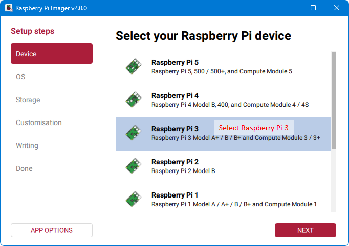

Raspberry Pi Imager dialog session pages are,

* Click **[NEXT]** to step next setup page
* Click **[BACK]** to step previous setup page
  * Be careful, once back to previous setup page,
    the parameter(s) on current setup page are(is)
    reset to default.

You will repeat operations that select or fill parameters, and then click **[NEXT]** until "Write Image" page.

### Choose operating system

Select "Raspberry Pi OS(64-bit)".

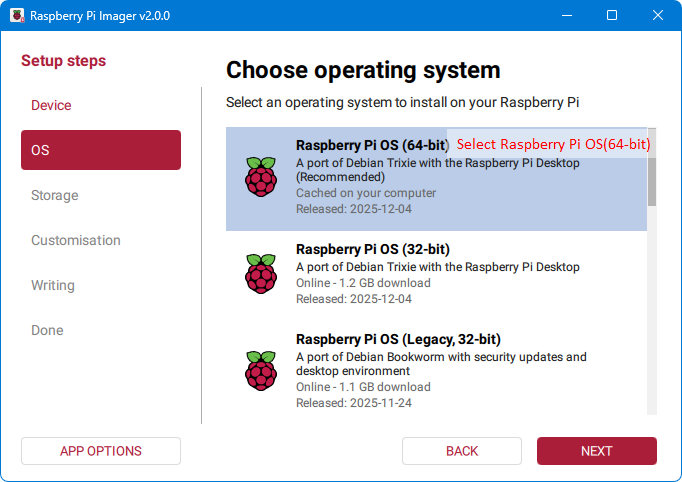

### Select your storage device

Find the removable storage media, and select it.

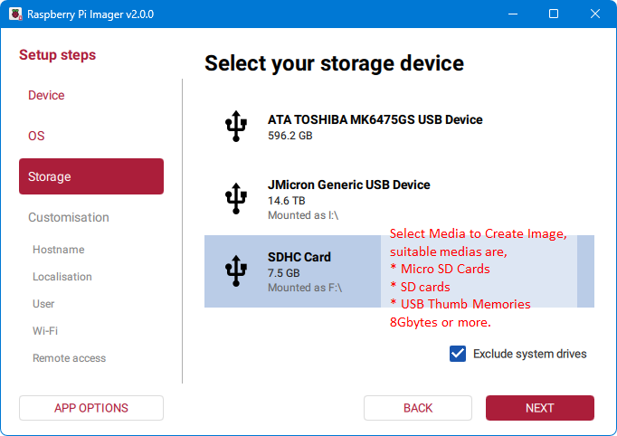

### Customization: Choose hostname

Enter the Raspberry Pi host name on the QEMU emulator.
This host name will be referred as _PiHostName_.

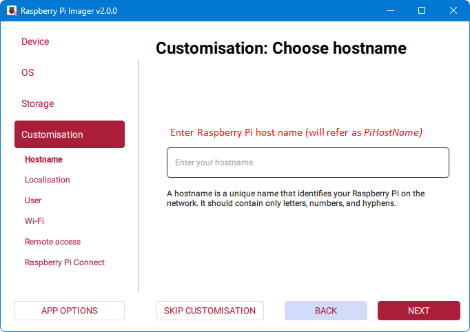

### Customization: Localisation

Select "Capital City" as you preferred. The "Capital city" affects only "Time zone".

Select keyboard layout same as emulator host keyboard.

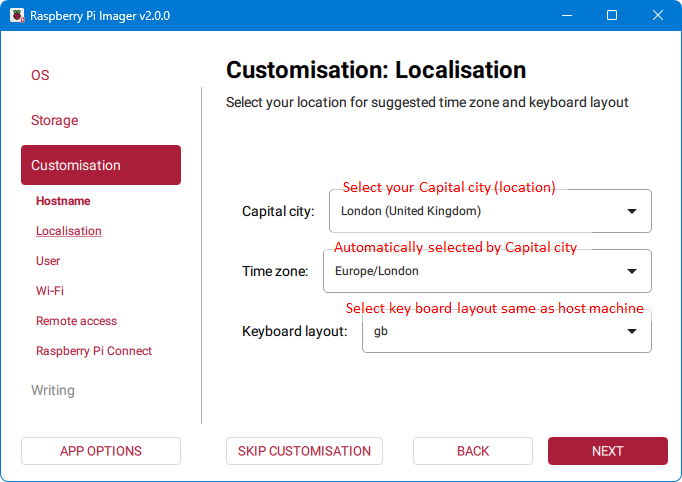

### Customization: Choose username

Fill Username, Passowrd, and "Confirm password".

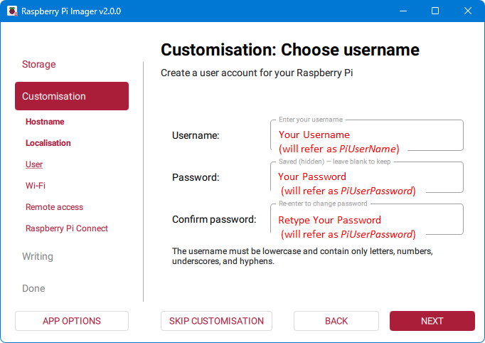

### Customization: Choose Wi-Fi

Leave blank "SSID", "Password", and "Confirm password". If these parameter(s) has(have) some value, it(they) doesn't(don't) effect to emulation.

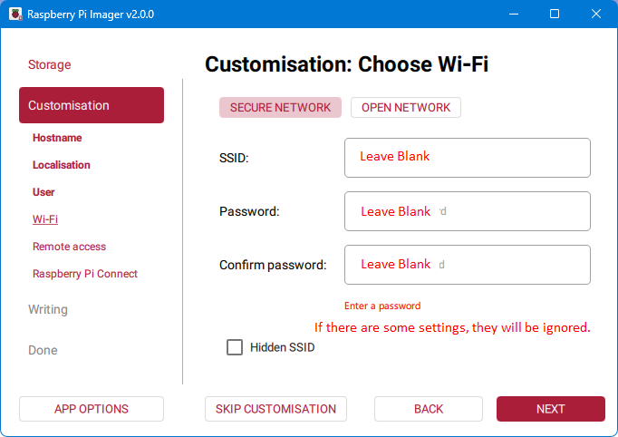

### Customization: SSH authentication

Select "Enable SSH" as On. Select "Authentication mechanism" as "Use password authentication".

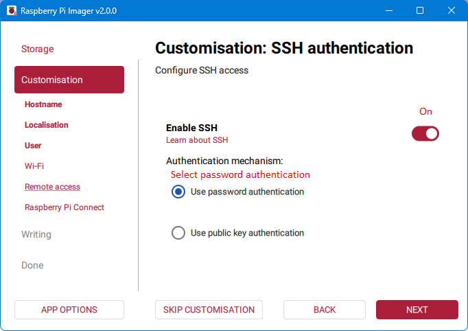

If you run the QEMU emulator with user mode network (build-in NAT).
Configure rpi3vm64.conf `NetDevOption` variable. For example,
setting `NetDevOption="user,id=net0,hostfwd=tcp::2022-:22"`
forwards connection to host port 2022 to guest port 22.

### Customization: Raspberry Pi Connect

Select "Enable Raspberry Pi Connect" as "Off".

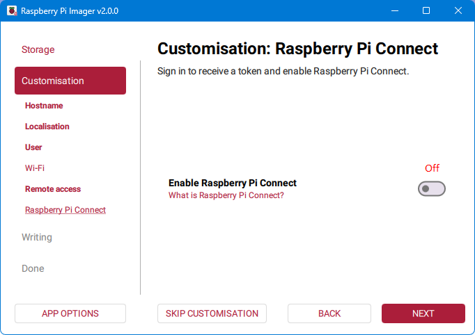

### Write image

Confirm "Storage" which is safe to write. Make confirmation, and click "WRITE".

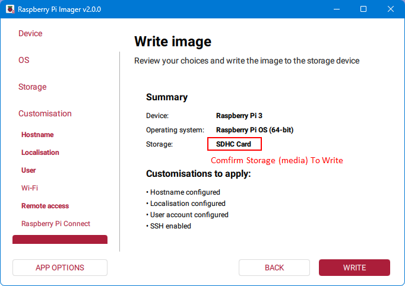

A few seconds after "I UNDERSTAND, ERASE AND WRITE" button becomes ready to click (now last chance to cancel erase and write). Click "I UNDERSTAND, ERASE AND WRITE" start writing Raspberry Pi OS image.

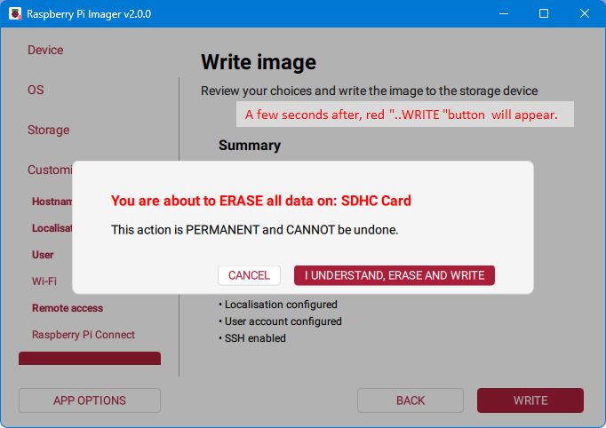

### Write Complete

Click "FINISH". The media written Raspberry Pi OS image is ready to remove.

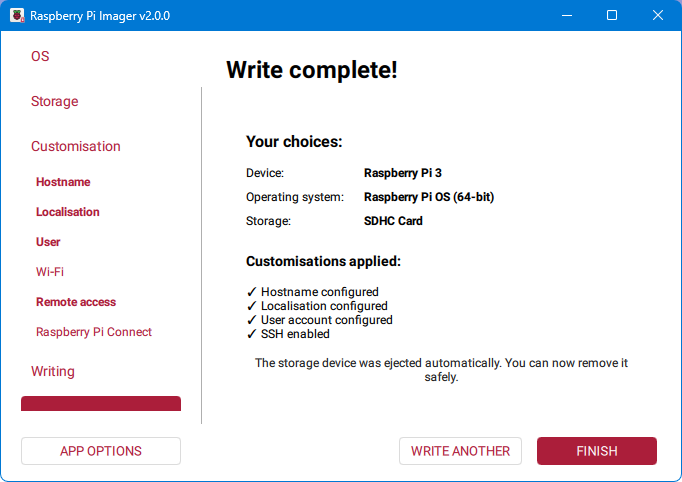
