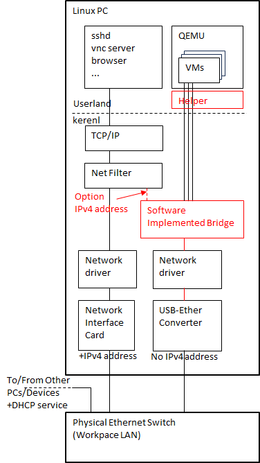
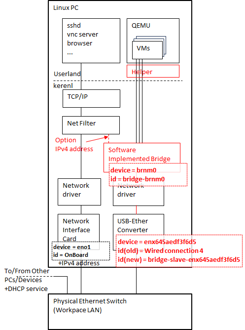
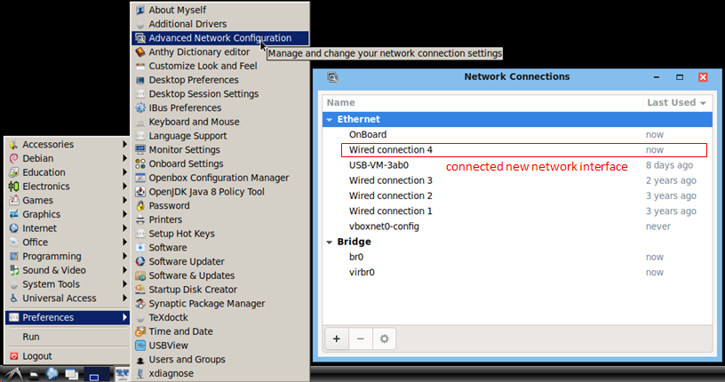
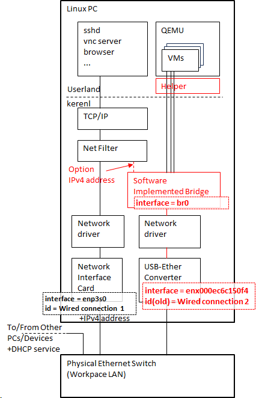

# Network Bridge を QEMU 向けに構成する

## はじめに

Linux PC 上で QEMU を使って仮想マシンを動かす場合に仮想マシンから外部の LAN 環境に接続するための構成方法を示します。次の様な環境を想定します。

+ Linux PC
  + Ubuntu あるいはこれに互換性があるディストリビューション
  + 比較的新しめな service 群で構成されている。次のうちどちらかか両方の service が動作している(動作させることができる)
    + NetworkManager service
    + networking service
+ Network Interface を 2 つ以上接続する
  + 1 つは普段の ssh 接続あるいは内部から外部に向かう接続に使います。今まで通りの運用を維持します。
  + もう一つは QEMU 用専用に使う
    + kernel 内に Software で実装した Bridge (ほぼ L2 switch として働く HUB と見做せる機能) 専用に使います
  + このように構成する理由は Network Interface の設定に失敗した場合に内外どちらに向かう方向ともアクセス不能になることを避けるためです
    + 正しく構成できれば Network Interface は 1 つで済みます(その方法も示します)
+ LAN 環境は DHCP service によって少なくとも IP address (IPv4 address) の振り出しが行われている

図で書くと次の様な環境です。※図は概要の把握を目的として書いてあります。正確性や厳密性はありません。



図の中で赤く書いた部分を構成します。

+ Software Implemented Bridge の部分
  + Linux kernel 内に bridge (ほぼ HUB と見做せる機能)を組み込む
    + nmcli (NetworkManager Command Line Interface) で設定する
    + または networking service (/etc/network/interfaces.d 以下に配置したファイル)で設定する
+ Helper の部分
  + QEMU のネットワーク設定で管理者権限を必要とする操作を setuid bit 付き実行ファイルで補助します

## 参考情報

+ [Introduction to Linux interfaces for virtual networking](https://developers.redhat.com/blog/2018/10/22/introduction-to-linux-interfaces-for-virtual-networking)
+ [Arch Linux ネットワークブリッジ](https://wiki.archlinux.jp/index.php/%E3%83%8D%E3%83%83%E3%83%88%E3%83%AF%E3%83%BC%E3%82%AF%E3%83%96%E3%83%AA%E3%83%83%E3%82%B8)
+ [debian NetworkConfiguration](https://wiki.debian.org/NetworkConfiguration)
+ [NetworkManager Reference Manual](https://networkmanager.dev/docs/api/latest/)
  + [manpage nmcli(1)](https://manpages.org/nmcli)
    + [manpage nmcli-examples(7)](https://manpages.org/nmcli-examples/7)
+ [manpage interfaces(5)](https://manpages.debian.org/bookworm/ifupdown/interfaces.5.en.html)
  + [manpage 
BRIDGE-UTILS-INTERFACES(5)](https://manpages.debian.org/testing/bridge-utils/bridge-utils-interfaces.5.en.html)
  + [manpage ifdown(8) ifdown(8)](https://manpages.debian.org/bookworm/ifupdown2/ifup.8.en.html)
+ [QEMU User Documentation](https://www.qemu.org/docs/master/system/qemu-manpage.html)
  + [QEMU Networking](https://wiki.qemu.org/Documentation/Networking)
  + [QEMU Helper Networking](https://wiki.qemu.org/Features/HelperNetworking)

## nmcli を使って bridge を構成する

### nmcli が使えるか確認する

ここでは [nmcli (Network Manager Command Line Interface)](https://manpages.org/nmcli) を使って Software Implemented Bridge (以下単に Bridge) を構成する手順を示します。

>[!TIP]
>伝統的な UNIX 系の設定である /etc/network 以下にファイルを配置する方式が好みであれば、[nmcli を使わない方法](#networking-service-伝統的な-interfaces-file-を使った-bridge-設定方法)で良いと思います。NetworkManager service と /etc/network 以下の設定 (networking service) を併用して構成することができます。

まず nmcli が使えるか確認します。

```bash
nmcli
```

ネットワーク状態が一通り表示されれば使えます。以下は表示例です(注目する部分だけ抜粋してあります)。

```text
eno1: connected to OnBoard
        "Realtek RTL8111/8168/8411"
        ethernet (r8169), 1C:1B:0D:9B:24:BC, hw, mtu 1500
        ip4 default, ip6 default
        inet4 192.168.0.16/24
        route4 0.0.0.0/0
        route4 192.168.0.0/24
        inet6 240f:6e:7f7:1:b0b3:74d1:e60e:9ee1/64
        inet6 fe80::d511:3dcf:ed8:8088/64
        route6 240f:6e:7f7:1::/64
        route6 ::/0
        route6 fe80::/64

lo: connected (externally) to lo
        "lo"
        loopback (unknown), 00:00:00:00:00:00, sw, mtu 65536
        inet4 127.0.0.1/8
        inet6 ::1/128

enx645aedf3f6d5: connected to Wired connection 4
        "Apple A1277"
        ethernet (asix), 64:5A:ED:F3:F6:D5, hw, mtu 1500
        inet4 192.168.0.52/24
        route4 0.0.0.0/0
        route4 192.168.0.0/24
        inet6 240f:6e:7f7:1:594d:6835:31fe:5f3e/64
        inet6 240f:6e:7f7:1:9b27:446d:5b87:9a75/64
        inet6 fe80::150:d018:502d:1063/64
        route6 240f:6e:7f7:1::/64
        route6 ::/0
        route6 fe80::/64
~~~ snip ~~~
```

リモート接続で作業している場合は、ここで表示された IP address (inet4 あるいは inet6 の値) をメモして下さい。この後の作業で失敗した場合、この IP address を直接指定して ssh 接続を確立し復旧作業を行うことになります。

そもそも nmcli がインストールされていない、あるいは、エラーが表示された場合は [networking service (/etc/network/interfaces.d 以下のファイル)](#networking-service-伝統的な-interfaces-file-を使った-bridge-設定方法) を使った設定を行います。以下は NetworkManger が動作していない旨を示すエラー出力の例です。

```text
Error: NetworkManager is not running.
```

### nmcli でネットワーク構成を確認する

bridge 接続で使用したい Network Interface を次の状態で接続します(接続した状態で起動します)。

+ ssh などでログインしてリモートで作業する場合は、可能であれば先にリモート接続を確立して下さい。
  + PCIe 接続の Network Interface を使う場合は、増設後に起動する流れになります。起動後に `nmcli`, `ip link` コマンドなどで IP address を確認して控えておき、作業中に接続が切れた場合に再接続できる様に備えて下さい。 
+ USB あるいは PCI express bus 接続などの形態でマシンに Converter か Network Interface Card を接続します。
+ Ethernet cable も接続した状態にして下さい。

ここでは USB-Ethernet converter を接続した次の図のような状況で手順を進めます。



Network Manager によって接続した Network Interface は自動的に構成されます(自動的に構成されない状況も有る)。GUI で Start Icon → Preferences → Advanced Network Configuration にて次の様に確認できます。



"Wired connecion 4" の様に機械的に命名された Connection name が付きます。
> [!TIP]
> Connection name は使うツールによって次の様に表現が変わります。
>
> |tool|representation|
> |----|--------------|
> |GUI (Advanced Network Configuration)|Name \| Connection name|
> |nmcli (man page)|id \| ID \| con-name|
> |nmcli conn show (list style)|NAME|
> |nmcli conn show \| edit \| modify (detail style)|connection.id|
>
> Network Manager 関連のマニュアルや UI の出来が悪く混乱すると思いますが、上手く解釈して下さい。

同様に `nmcli conn show` で確認します。

```bash
nmcli conn show
```

次の出力例にある "Wired connection 4" の部分が新しく追加した USB-Ethernet converter です(見やすいように実機から採取した出力を編集してあります)。

```text
NAME                UUID                                  TYPE      DEVICE          
OnBoard             3b9ac036-3955-3430-89d0-d38652ff22a7  ethernet  eno1            
Wired connection 4  bc3b61cc-7829-3569-be68-36a189e06de9  ethernet  enx645aedf3f6d5
-- snip --
# Ignore outputs colored by dark green.
```

> [!TIP]
> 暗い緑色で<span style="color: darkgreen">表示される出力</span>は無視して下さい。設定ではありません。

> [!NOTE]
> もし、接続した USB-Ethernet converter に NetworkManager による自動設定がされない場合、"Wired connection 4" の様な Connection name が付いた設定は現れません。この場合後に出てくる `sudo nmcli conn delete "Wired connection 4"` という操作は不要です。

以下、次の様な設定を識別する文字列(名前)が出てきます。環境や事情毎に変わります。読み替えが必要だったり、衝突を回避するために変える必要があります。

|identifier string|object class|description|
|------------------|--------------------|-----------|
|Wired connection 4|Connection name (id)|NetworkManager が USB-Ethernet conveter enx645aedf3f6d5 に適用する設定です。自動的に付けられた名前です。|
|enx645aedf3f6d5|device|USB-Ethernet converter のデバイス名です。PICe カードの NIC ならば ethN \| enoN \| enpNsM の様な名前が自動的に付きます。|
|brnm0|device (bridge)|Kernel 内に設置する Software Implemented Bridge の device 名です。任意に付けることができます。ここでは brnm0 (NetworkManager で設定した 0 番目の bridge) と命名します。|
|bridge-brnm0|Connection name (id)|brnm0 に適用する設定です。nmcli が brnm0 に bridge- を接頭辞に付けて生成した名前です。|
|bridge-slave-enx645aedf3f6d5|Connection name (id)|USB-Ethernet converter enx645aedf3f6d5 を slave、bridge brnm0 を master とする接続設定(関連付け)です。nmcli が bridge-slave- を接頭辞に付けて生成した名前です。|
|eno1|device|eno1は直接の操作対象ではありません。host machine の内外接続に使用し、並列して LAN へ接続します。|
|OnBoard|Connection name (id)|eno1の設定です。直接の操作対象ではありません。|

> [!TIP]
> NetworkManager の根本的な設計思想に「デバイス (device) とそれに対する設定 (connection) は別々に識別するべきだ」という思想がありそうです。この様な抽象化が役立つほどに高度なことは自分はできていません。

### nmcli でネットワーク構成を設定する

確認した構成に bridge を追加します。

```bash
# Add bridge brnm0,
#  Create bridge-brnm0 connection.
sudo nmcli conn add type bridge ifname brnm0
# Disable spanning tree protocol in brnm0.
sudo nmcli conn modify bridge-brnm0 bridge.stp no
# Configure network device enx645aedf3f6d5 as bridge-slave,
#  Create bridge-slave-enx645aedf3f6d5 connection.
sudo nmcli conn add type bridge-slave ifname enx645aedf3f6d5 master bridge-brnm0
# Disable DHCP IPv4 configuration on connection bridge-brnm0 (applies to brnm0)
sudo nmcli conn modify bridge-brnm0 ipv4.method disabled
```

<A name="Recover-nmcli-message-recipient-disconnected"></a>
### nmcli エラー connection: Message recipient disconnected from message bus without replying が出た場合の対応

もし、nmcli が次の様なエラーで終了したら、設定結果は中途な状態になっています。

```text
Error: Failed to add 'bridge-brnm0' connection: Message recipient disconnected from message bus without replying
```

エラーが発生したら、次のコマンドは実行せずに即座に次に示す回復操作をします。エラーで完了できなかった操作を完了し、結果が確定します。

```bash
# Recover "Message recipient disconnected from message bus without replying"
#  Sync systemd states with services keeping system.
sudo systemctl daemon-reload
#  Restart NetworkManager.
sudo systemctl restart NetworkManager
#  Wait NetworkManager becomes online and reload network connection.
sudo nm-online && sudo nmcli conn reload
#  See settings are stored correctly.
nmcli conn show
```

上記操作でも回復していないと思われる場合は、次の操作をして下さい。

```bash
# Recover "Message recipient disconnected from message bus without replying",
#  using dpkg-reconfigure
sudo dpkg-reconfigure network-manager
#  See settings are stored correctly.
nmcli conn show
```

> [!WARNING]
> `Message recipient disconnected from message bus without replying` というエラーが発生したならば、エラーの原因となったコマンドを再実行しないで下さい。
>
> /etc/netplan/* 以下に実行結果が多重に滞留し、意図しない結果になる可能性があります。復旧操作を行った後、`nmcli conn show` にて状況を確認し、`sudo nmcli conn delete` _connectin-name_ にて余計な設定を削除して下さい。`sudo nmcli conn delete` にて困難な状況を解消できない場合は、次の様にして下さい。
>
> + /etc/netplan/* 以下のファイル内容を読む
> + name key が重複したファイルを特定する
> + 上記の重複したファイルを削除する
>
> 私見ですが systemd といい NetworkManger といいシステムの根幹をなす部分を複雑化して、確実に動作する見込みがないもの(あるいはテストが困難なもの)に変えていくのは如何なものかと思っています。
>
> NetworkManager はいつからか内部に netplan という物を内包して設定保存先が /etc/NetworkManager/system-connections から /etc/netplan へ変更になり、文法もいわゆる Windows INI から yaml に変更しています。メリットが乏しい「やっている感」だけの進化は勘弁して欲しい。

bridge-brnm0 に対する設定のうち bridge.stp と ipv4.method の意図は次の様になっています。

|setting property|value|description|
|----------------|-----|-----------|
|bridge.stp|no|bridge nmbr0 で STP (Spanning Tree Protocol) を使わない設定です。STP の機能は「bridge 間の通信経路を多重に作った場合、ループ構造が作られます。これを途中で論理的に切断して、ループ構造を取り除き、パケットの永久回遊を防ぐ機能」です。複雑な構成ではないので no (使わない) 設定にしました。故障などで経路が不通になった場合、自動的に多重になっている経路から、新しい通信経路を再構成する機能を含んでいますが、そこまでの安定運用は狙っていません。|
|ipv4.method|disabled|brnm0 とこの slave device である enx645aedf3f6d5 を QEMU 仮想マシン群のネットワーク接続専用として使います。[auto に設定した場合の挙動や利点・欠点については別記](#bridge-に-ip-address-を割り当てる操作)します。|

ここまで設定が済んだら、結果を `nmcli conn show` で確認します。

```bash
nmcli conn show
```

以下は出力例です。bridge-brnm0 と bridge-slave-enx645aedf3f6d5 という Connection が作られます。

```text
NAME                          UUID                                  TYPE      DEVICE          
OnBoard                       3b9ac036-3955-3430-89d0-d38652ff22a7  ethernet  eno1            
Wired connection 4            bc3b61cc-7829-3569-be68-36a189e06de9  ethernet  enx645aedf3f6d5 
bridge-brnm0                  3a2e41a1-831b-4294-8885-a8184d161d23  bridge    brnm0           
bridge-slave-enx645aedf3f6d5  cf78f701-4cf8-4a5a-931e-6bd9bc7e158a  ethernet  enx645aedf3f6d5
-- snip --
```

device はそれぞれ次の様になっています。

|connection name (NANME)|device (DEVICE)|
|-----------------------|---------------|
|bridge-brnm0|brnm0|
|bridge-slave-enx645aedf3f6d5|enx645aedf3f6d5|

確認したら自動的に構成された connection "Wired connection 4" を削除します。削除しないと "Wired connection 4" は device enx645aedf3f6d5 に対して多重設定となり、上手く動作しません。

```bash
# Delete connection "Wired connection 4", "Wired connection 4" is replaced with "bridge-slave-enx645aedf3f6d5"
sudo nmcli conn delete "Wired connection 4"
```

設定を最終確認します。

```bash
nmcli conn show
```

次の様に "Wired connection 4" が無い出力になります。

```text
NAME                          UUID                                  TYPE      DEVICE          
OnBoard                       3b9ac036-3955-3430-89d0-d38652ff22a7  ethernet  eno1            
bridge-brnm0                  3a2e41a1-831b-4294-8885-a8184d161d23  bridge    brnm0           
bridge-slave-enx645aedf3f6d5  cf78f701-4cf8-4a5a-931e-6bd9bc7e158a  ethernet  enx645aedf3f6d5 
```

全ての setting property を確認したい場合は次のコマンドを使って下さい。

```bash
nmcli conn show bridge-brnm0
nmcli conn show bridge-slave-enx645aedf3f6d5
```

次のリンクは実機で採取した setting property の値です。確認に利用して下さい。設定は connection.id の様に小文字, '.', '-' で構成されたプロパティに格納されています。大文字を使って構成されているプロパティは動作状況で変化します。

+ [nmcli conn show nmbr0](../snippets/nmcli-conn-show-nmbr0.txt)
+ [nmcli conn show bridge-slave-enx645aedf3f6d5](../snippets/nmcli-conn-show-bridge-slave-enx645aedf3f6d5.txt)

bridge-brnm0 と bridge-slave-enx645aedf3f6d5 の設定を反映します。リモート接続で作業している状況次第では途中でリモート接続が切れる場合があります。この場合、作業冒頭でメモした IP address を使って再度接続を行ってできなかった作業を続けて下さい。

```bash
# To reconfigure device brnm0, down and up device brnm0.
sudo nmcli conn down bridge-brnm0; sleep 1; sudo nmcli conn up bridge-brnm0
# Remove IP address configuration from device enx645aedf3f6d5. 
#  It may disconnect remote login session.
sudo nmcli conn down bridge-slave-enx645aedf3f6d5; sleep 1; sudo nmcli conn up bridge-slave-enx645aedf3f6d5
```

> [!TIP]
> nmcli の設定を削除するには、`nmcli conn delete` _connection_name_ を使います。設定に問題があると思われる場合に使って下さい。
>
> 一部の設定だけを対話的に修正したい場合は、`nmcli conn edit` _connection_name_ を使用して下さい。対話プロンプトで `help`, `describe` _property_ を利用できます。
>
> 設定は /etc/netplan または /etc/NetworkManager/system-connections 以下に格納されます。root 権限で読むことができます。

ここまで行った nmcli を使った設定は保存され、起動後も適用されます。

## QEMU のネットワーク設定 helper を root 権限昇格できる様にする

QEMU で動かす仮想マシンから利用する network bridge に対する操作は root 権限が必要です。一般ユーザーで network bridge を利用できる様にするため、qemu-bridge-helper が用意されています。[QEMU の wiki Features/HelperNetworking](https://wiki.qemu.org/Features/HelperNetworking) に参考になる記事があります。

### qemu-bridge-helper をインストールする

QEMU のインストールが済んでいるならば、qemu-bridge-helper もインストール済みになっているはずです。インストールを確実にするため、次のコマンドを実行して下さい。

```bash
sudo apt install qemu-system-common
```

qemu-bridge-helper の場所を dpkg-query -S で探します。/usr/lib/qemu/qemu-bridge-helper に配置されている場合は次の様な表示になります。

```text
dpkg-query -S qemu-bridge-helper
qemu-system-common: /usr/lib/qemu/qemu-bridge-helper
```

以下 /usr/lib/qemu/qemu-bridge-helper に有るものとして進めます。

### qemu-bridge-helper で操作する bridge device を設定する

qemu で使用する bridge device を設定します。bridge 操作権限許可の設定になります。

```bash
# Create /etc/qemu directory, it may not be created at first time.
sudo mkdir -p /etc/qemu
# Edit bridge.conf
sudo nano /etc/qemu/bridge.conf
```

/etc/qemu/bridge.conf に `allow` 行を追加して下さい。次の様になります。

```text
allow brnm0
```

### qemu-bridge-helper の setuid 付き実行ファイルを作る

setuid 付きの /usr/lib/qemu/qemu-bridge-helper-suid を作成します。

> [!NOTE]
> root 所有の実行ファイルに setuid を付与するのはセキュリティの観点から議論が起きます。qemu-bridge-helper setuid などで検索すると、議論が起きている会話スレッドが見つかります。また、限定権限を付与する apparmor (SELinux を用いたセキュリティ機構)を使用する方法も模索・提案されています。
>
> しかし、apparmor では上手くいかないようです。Linux kernel 内の [ioctl TUNSETIFF](https://elixir.bootlin.com/linux/v6.8/C/ident/TUNSETIFF) を処理する [tun_set_iff()](https://elixir.bootlin.com/linux/v6.8/source/drivers/net/tun.c#L2742) から呼ばれる [tun_not_capable()](https://elixir.bootlin.com/linux/v6.8/source/drivers/net/tun.c#L577) による権限判定が [capability net_admin (CAP_NET_ADMIN)](https://elixir.bootlin.com/linux/v6.8/source/include/uapi/linux/capability.h#L204) だけでは不足する権限判定をしているのではないかと考えています(確定的な調査はしていません)。
>
> ここでは単純なスクリプト攻撃を避け、既存の依存関係と環境を壊さない様に qemu-bridge-helper を qemu-bridge-helper-suid にコピーして、これに setuid を付与する様にしました。

qemu-bridge-helper が有るディレクトリ /lib/usr/qemu に移動、コピーして setuid 付きの実行ファイルを作ります。

``` bash
# Change work directory to having qemu-bridge-helper
cd /usr/lib/qemu
# Check if qemu-bridge-helper exists
ls -la
```

次の様に qemu-bridge-helper が見つかるはずです。

```text
total NNNN # NNNN is the number of usage bytes of this directory.
drwxr-xr-x   2 root root   4096 Jan 26 03:18 .
drwxr-xr-x 148 root root   4096 Jan 26 00:18 ..
-rwxr-xr-x   1 root root 687280 Dec 12 12:06 qemu-bridge-helper
-rwxr-xr-x   1 root root 789968 Dec 12 12:06 vhost-user-gpu
-rwxr-xr-x   1 root root 703664 Dec 12 12:06 virtfs-proxy-helper
```

続けて copy と chmod を行います。

```bash
# Copy
sudo cp -p qemu-bridge-helper qemu-bridge-helper-suid
# Set UID bit
sudo chmod u+s qemu-bridge-helper-suid
# Check qemu-bridge-helper-suid permissions,
#  It should be seen -rwsr-xr-x.
ls -la
```

qemu-bridge-helper-suid の属性が `-rwsr-xr-x` となっていることを確認して下さい。

```text
total NNNN
drwxr-xr-x   2 root root   4096 Jan 26 03:18 .
drwxr-xr-x 148 root root   4096 Jan 26 00:18 ..
-rwxr-xr-x   1 root root 687280 Dec 12 12:06 qemu-bridge-helper
-rwsr-xr-x   1 root root 687280 Dec 12 12:06 qemu-bridge-helper-suid
-rwxr-xr-x   1 root root 789968 Dec 12 12:06 vhost-user-gpu
-rwxr-xr-x   1 root root 703664 Dec 12 12:06 virtfs-proxy-helper
```

### qemu-bridge-helper-suid の使用例

qemu-bridge-helper-suid は次の qemu-system-arm を使った Raspberry Pi 2B 仮想マシン起動例の様に使います。

```bash
#!/bin/bash
# Boot Virtual Raspberry Pi 2B with Raspberrypi OS 32bit image.

qemu-system-arm \
-machine raspi2b \
-kernel bootfs/kernel7.img \
-dtb bootfs/bcm2709-rpi-2-b.dtb \
-drive format=raw,file=rpi2vm32-3.img \
-append "console=ttyAMA0,115200 console=tty1 root=/dev/mmcblk0p2 rootfstype=ext4 fsck.repair=yes rootwait dwc_otg.fiq_fsm_enable=0 bcm2708_fb.fbwidth=1024 bcm2708_fb.fbheight=768" \
-serial stdio \
-no-reboot \
-device usb-kbd \
-device usb-tablet \
-netdev tap,br=brnm0,helper=/usr/lib/qemu/qemu-bridge-helper-suid,id=net0 \
-device usb-net,netdev=net0,mac=40:54:00:52:20:03 \
-vnc :12 \
$*
```

上記の例のうち重要な部分は次の通りです。

```text
-netdev tap,br=brnm0,helper=/usr/lib/qemu/qemu-bridge-helper-suid,id=net0 \
-device usb-net,netdev=net0,mac=40:54:00:52:20:03 \
```

`-netdevice` で bridge brnm0 に tap を設定するときに helper として qemu-bridge-helper-suid を使用します。`-device` にて仮想マシンに仮想的な USB-Ethernet converter usb-net を接続、tap を識別子 net0 を通して使用します(qemu-system-arm 実行中は network device tapN が追加されます)。


## nmcli を使った場合で bridge に IP address を割り当てる (任意)

作成した bridge brnm0 に IP address を割り当てる使い方もできます。ここでは DHCP で IP address が自動的に付与される環境を想定しています。

<a name="pros-cons-bridge-has-a-address"></a>
### bridge に IP address を割り当てる 利点・欠点

bridge に IP address を割り当てる利点・欠点は次の通りです。

+ IP address を割り当てない (ipv4.method disabled にして、host machine と bridge の Network Interface を別にする)
  + 利点
    + bridge の設定・操作をしても外部からの host machine 操作に影響が出ない
    + 仮想マシン群の通信と host machine の通信は互いに独立し、お互いに通信量による影響を受けない
    + bridge に割り当てた Network Interface の通信速度が遅くても良い
  + 欠点
    + 物理的な Network Interface を増設する
+ IP address を割り当てる (ipv4.method auto or manual にして、host machine 通信用途 Network Interface を bridge 接続と兼用する)
  + 利点
    + Network Interface を兼用でき、物理的な Network Interface を増設する必要がない
  + 欠点
    + bridge の設定・操作を誤った場合、外部から host machine に接続できなくなり、障害対応は直接操作に限られる
    + 仮想マシン群の通信と host machine の通信が合流され、お互いに通信量の影響を受ける
      + 接続先の物理 Hub の通信容量は余裕がある想定です
      + 実際に遅くなり、操作に違和感・ストレスを感じる状況があった
  
### bridge に IP address を割り当てる操作

次の様にして bridge に DHCP から振り出した IPv4 address を付与することができます。

```bash
# Enable DHCP IPv4 configuration on connection bridge-brnm0 (applies to brnm0)
sudo nmcli conn modify bridge-brnm0 ipv4.method auto
# Sync systemd with NetworkManger
sudo systemctl daemon-reload
# Restart NetworkManager
sudo systemctl restart NetworkManager
# Check configured network devices.
nmcli
```

操作終了後に同一セグメント内の 2 つのアドレスを host machine に割り当てる状態になります。依然として通信は維持できますし、新しい接続も内外どちらに向かう方向でも可能です。

一つの Network Interface で host machine 通信と仮想マシン群の通信を兼用できます。

## networking service (伝統的な interfaces file) を使った bridge 設定方法

/etc/network/interfaces.d 以下にファイルを配置し networking service を使って bridge を設定する方法を示します。NetworkManager と併用できます。

ここでは次の様に既設の Network Interface enp3s0 に並列して USB-Ethernet coverter enx000ec6c150f4 を接続します。interface enx000ec6c150f4 を通して外部と接続する Software Implemented Bridge br0 を設定します。以下 Software Implemented Bridge br0 は単に bridge br0 と呼びます。



> [!NOTE]
> NetworkManager を使った設定で device と呼んでいた対象をここでは伝統に従い interface と呼びます。

以降、次の識別子を使用します。衝突を避けるため変更したり、使用する器機によって変ります。読み替えて下さい。

|identifier|class|description|
|----------|-----|-----------|
|br0|interface (bridge)|bridge の名前です。0 番目の bridge という名称にしています。|
|enx000ec6c150f4|interface|USB-Ethernet converter を識別する interface 名です。converter の MAC address を元に名前が付きます。環境によっては伝統的な ethN などの名称になる場合もあります。|
|Wired connection 2|Connection name (ID)|NetworkManager が interface enx000ec6c150f4 に適用する設定に付けた名前です。|
|enp3s0|interface|enp3s0 は直接の操作対象ではありません。host machine の内外通信をするために並列に使用する interface です。|
|Wired connection 1|Connection name (ID)|NetworkManager が interface enp3s0 に適用する設定です。直接の操作対象ではありません。|

### networking service に必要な package をインストールする

networking service と伝統的な UNIX network ツール群をインストールします。

```bash
sudo apt install ifupdown net-tools bridge-utils
```

### Network Interface の存在を確認する

bridge に使用する USB-Ethernet converter の存在を確認します。

```bash
# Read dmesg and find messages at probing Network Interface device.
sudo dmesg
# List Network Interfaces.
ifconfig -a
# List NetworkManager settings.
#  When NetworkManager service is not running, you may got an error.
nmcli conn show
```

`dmesg` の出力に認識した結果があるか読み取ります。Interface 名enx000ec6c150f4, MAC address `00:0e:c6:c1:50:f4` が読み取れます。

```text
[176173.674545] usb 1-1.5: new high-speed USB device number 5 using ehci-pci
[176173.768162] usb 1-1.5: New USB device found, idVendor=0b95, idProduct=7720, bcdDevice= 0.01
[176173.768170] usb 1-1.5: New USB device strings: Mfr=1, Product=2, SerialNumber=3
[176173.768183] usb 1-1.5: Product: AX88x72A
[176173.768186] usb 1-1.5: Manufacturer: ASIX Elec. Corp.
[176173.768189] usb 1-1.5: SerialNumber: 00042C
[176174.326149] asix 1-1.5:1.0 (unnamed net_device) (uninitialized): PHY [usb-001:005:10] driver [Asix Electronics AX88772A] (irq=POLL)
[176174.329514] Asix Electronics AX88772A usb-001:005:10: attached PHY driver (mii_bus:phy_addr=usb-001:005:10, irq=POLL)
[176174.329874] asix 1-1.5:1.0 eth0: register 'asix' at usb-0000:00:1a.0-1.5, ASIX AX88772 USB 2.0 Ethernet, 00:0e:c6:c1:50:f4
[176174.351705] asix 1-1.5:1.0 enx000ec6c150f4: renamed from eth0
[176174.373639] asix 1-1.5:1.0 enx000ec6c150f4: configuring for phy/internal link mode
[176176.489399] asix 1-1.5:1.0 enx000ec6c150f4: Link is Up - 100Mbps/Full - flow control rx/tx
```

> [!TIP]
> PCIe Network Interface Card を増設した場合は、kernel 起動時に認識されます。起動した直後にログインして `sudo dmesg` で認識結果を確認して下さい。

`ifconfig -a` の出力を確認します。認識されて enx000ec6c150f4 が現れるはずです。IPv4 address が付与されない場合もありますが、問題にはなりません。外部から接続して操作している場合は、不意の切断に備えて IP address メモして下さい。

```text
enp3s0: flags=4163<UP,BROADCAST,RUNNING,MULTICAST>  mtu 1500
        inet 192.168.0.93  netmask 255.255.255.0  broadcast 192.168.0.255
        inet6 fe80::e760:1c5e:9c3b:63b4  prefixlen 64  scopeid 0x20<link>
        inet6 240f:6e:7f7:1:b15:1cb5:5104:6db2  prefixlen 64  scopeid 0x0<global>
        inet6 240f:6e:7f7:1:2f2c:db1c:b680:9875  prefixlen 64  scopeid 0x0<global>
        inet6 240f:6e:7f7:1:45c2:9d3e:c30f:23b2  prefixlen 64  scopeid 0x0<global>
        ether 50:46:5d:05:49:d6  txqueuelen 1000  (Ethernet)
        RX packets 1553821  bytes 257238249 (257.2 MB)
        RX errors 0  dropped 0  overruns 0  frame 0
        TX packets 451019  bytes 373613710 (373.6 MB)
        TX errors 0  dropped 0 overruns 0  carrier 0  collisions 0
        device interrupt 16  

enx000ec6c150f4: flags=4163<UP,BROADCAST,RUNNING,MULTICAST>  mtu 1500
        inet 192.168.0.67  netmask 255.255.255.0  broadcast 192.168.0.255
        inet6 fe80::c809:1755:160:4f9d  prefixlen 64  scopeid 0x20<link>
        inet6 240f:6e:7f7:1:efbe:8091:1dcc:4fed  prefixlen 64  scopeid 0x0<global>
        inet6 240f:6e:7f7:1:1052:1d7b:de7d:2b12  prefixlen 64  scopeid 0x0<global>
        ether 00:0e:c6:c1:50:f4  txqueuelen 1000  (Ethernet)
        RX packets 3487  bytes 235467 (235.4 KB)
        RX errors 0  dropped 0  overruns 0  frame 0
        TX packets 137  bytes 20337 (20.3 KB)
        TX errors 0  dropped 0 overruns 0  carrier 0  collisions 0
--- snip ---
```

`nmcli conn show` の出力を確認します。これは、NetwokManager による設定が衝突する場合があり、作業の最終段階で設定を削除する目的で調べます。次は `Wired connection 2` という設定で enx000ec6c150f4 が設定されています。

```text
NAME                          UUID                                  TYPE      DEVICE          
Wired connection 1            a12d4fa9-1896-3378-ac37-b7e014fdcc67  ethernet  enp3s0          
Wired connection 2            9190e4b6-3887-4a69-8943-8e642b408968  ethernet  enx000ec6c150f4 
-- snip --
# ignore outputs colored by dark green.
```

> [!TIP]
> 暗い緑色で<span style="color: darkgreen">表示される出力</span>は無視して下さい。設定ではありません。

> [!NOTE]
> `nmcli conn show` を実行してエラーであれば NetworkManager との衝突は無いので、後に出てくる `sudo nmcli conn delete enx000ec6c150f4` という操作は不要です。

### /etc/network/interfaces.d 以下に bridge 設定ファイルを作成する

/etc/network/interfaces ファイル内容を確認します。

```bash
cat /etc/network/interfaces
```

cat の出力には次の様にどこかの行に `source /etc/network/interfaces.d/*` が入っていることを確認して下さい。もし、入っていなければ、追加して下さい。

```text
source /etc/network/interfaces.d/*
```

> [!TIP]
> 非常に古い networking service だと /etc/network/interfaces に source 行を含めることができないかもしれません。作業環境にて manual page `man 5 interfaces` を確認してください。この場合は /etc/network/interfaces.d 以下に追加するファイル内容を直接 /etc/network/interfaces ファイルに追記して下さい。

次の様に bridge br0 を設定するファイルを作ります。nano editor 以外で作業しても良いですし、ファイルを別に準備して copy にて配置する方法でも良いです。

```bash
# Create interfaces.d directory.
sudo mkdir -p /etc/network/interfaces.d
# Create bridge br0 configuration file.
#  You can use your favorite editor other than nano.
sudo nano /etc/network/interfaces.d/enx000ec6c150f4-br0
```

ファイル名は enx000ec6c150f4-br0 としています。読み込み順を考慮する必要がある場合は、 /etc/network/interfaces.d 以下に配置されたファイル群と整合性がとれるようにして下さい。enx000ec6c150f4-br0 ファイルの内容は次の通りです。
<a name="file-enx000ec6c150f4-br0"></a>
```text
auto br0
iface br0 inet manual
	bridge_ports	enx000ec6c150f4
	bridge_stp	off
	bridge_maxwait	10
```

設定は次の様になっています。

|option|value|description|
|------|-----|-----------|
|inet|manual|bridge には IP address を付与しない設定です。DHCP による自動構成、あるいは固定アドレス設定はしません。他の選択肢は dhcp: DHCP で構成、 static: 固定アドレスで設定 です。|
|bridge_ports|enx000ec6c150f4|bridge の外部接続に使う USB-Ethernet converter の interface 名です。|
|bridge_stp|off|Spanning Tree Protocol を使わない設定です。外部内部ともループを構成する様なネットワークにしないので off にしておきます。|
|bridge_maxwait|10|networking service load 時から bridge_ports に指定した interface enx000ec6c150f4 が kernel で初期化処理されて利用可能になるまで待つ時間を 10 秒にしています。主に linux 起動時に関係します。kernel の probe 処理が大量の device の存在により遅れたり、module load などで遅延するなどの場合に待つ時間になります。|


設定を反映します。

```bash
# Delete NetworkManager connection setting.
sudo nmcli conn delete 'Wired connection 2'
# Reload systemd settings.
#  Modifying under /etc/network/* without daemon-reload
#  may cause an error when enable/restart networking service.
sudo systemctl daemon-reload
# Enable networking service.
sudo systemctl enable networking
# To reload /etc/network/interfaces.d/*, restart networking setvice.
sudo systemctl restart networking
# Check bridge configurations.
brctl show
# Check result.
ifconfig -a
```

> [!TIP]
> [nmcli がエラーになってしまった場合の対応](#Recover-nmcli-message-recipient-disconnected)


`brctl show` の出力結果は次の様になっているはずです(注目が必要な部分のみ抜粋)。

```text
bridge name     bridge id               STP enabled     interfaces
br0             8000.5620f1550daf       no              enx000ec6c150f4
-- snip --
```

`ifconfig` の出力は次の様になっているはずです(注目が必要な部分のみ抜粋)。
```text
br0: flags=4163<UP,BROADCAST,RUNNING,MULTICAST>  mtu 1500
        inet6 240f:6e:7f7:1:2b0d:1300:30c2:7381  prefixlen 64  scopeid 0x0<global>
        inet6 240f:6e:7f7:1:5420:f1ff:fe55:daf  prefixlen 64  scopeid 0x0<global>
        inet6 fe80::5420:f1ff:fe55:daf  prefixlen 64  scopeid 0x20<link>
        ether 56:20:f1:55:0d:af  txqueuelen 1000  (Ethernet)
        RX packets 336692  bytes 24790779 (24.7 MB)
        RX errors 0  dropped 0  overruns 0  frame 0
        TX packets 73  bytes 12494 (12.4 KB)
        TX errors 0  dropped 0 overruns 0  carrier 0  collisions 0

enp3s0: flags=4163<UP,BROADCAST,RUNNING,MULTICAST>  mtu 1500
        inet 192.168.0.93  netmask 255.255.255.0  broadcast 192.168.0.255
        inet6 fe80::e760:1c5e:9c3b:63b4  prefixlen 64  scopeid 0x20<link>
        inet6 240f:6e:7f7:1:b15:1cb5:5104:6db2  prefixlen 64  scopeid 0x0<global>
        inet6 240f:6e:7f7:1:2f2c:db1c:b680:9875  prefixlen 64  scopeid 0x0<global>
        inet6 240f:6e:7f7:1:2ba8:9fdc:60b1:5fb5  prefixlen 64  scopeid 0x0<global>
        inet6 240f:6e:7f7:1:45c2:9d3e:c30f:23b2  prefixlen 64  scopeid 0x0<global>
        ether 50:46:5d:05:49:d6  txqueuelen 1000  (Ethernet)
        RX packets 2049511  bytes 496707014 (496.7 MB)
        RX errors 0  dropped 0  overruns 0  frame 0
        TX packets 628223  bytes 475994371 (475.9 MB)
        TX errors 0  dropped 0 overruns 0  carrier 0  collisions 0
        device interrupt 16  

enx000ec6c150f4: flags=4163<UP,BROADCAST,RUNNING,MULTICAST>  mtu 1500
        inet6 fe80::c809:1755:160:4f9d  prefixlen 64  scopeid 0x20<link>
        ether 00:0e:c6:c1:50:f4  txqueuelen 1000  (Ethernet)
        RX packets 370747  bytes 34744085 (34.7 MB)
        RX errors 0  dropped 1  overruns 0  frame 0
        TX packets 1423  bytes 323542 (323.5 KB)
        TX errors 0  dropped 0 overruns 0  carrier 0  collisions 0
-- snip --
```

## /etc/network/interfaces 以下の設定で bridge を構成した場合の QEMU のネットワーク設定

[QEMU のネットワーク設定は nmcli を使った場合と同様](#qemu-のネットワーク設定-helper-を-root-権限昇格できる様にする)です。nmbr0 を br0 に読み替えて作業して下さい。

## /etc/network/interfaces 以下の設定で bridge を構成した場合に bridge に IP address を設定する

[file /etc/network/interfaces.d/enx000ec6c150f4-br0](#file-enx000ec6c150f4-br0) の内容を次の様に `inet manual` から `inet dhcp` に変更します。

```text
auto br0
iface br0 inet dhcp
	bridge_ports	enx000ec6c150f4
	bridge_stp	off
	bridge_maxwait	10
```

こうすると bridge br0 に使用する interface と host machine の内外通信にする interface を兼用することができます。設定後は、次の様に設定を反映して、結果を確認します。

```bash
# Reload systemd settings.
#  Modifying under /etc/network/* without daemon-reload
#  may cause an error when enable/restart networking service.
sudo systemctl deamon-reload
# Enable networking service.
sudo systemctl enable networking
# To reload /etc/network/interfaces.d/*, restart networking setvice.
sudo systemctl restart networking
# Down and Up interface.
sudo ifdown br0; sudo ifup br0
# Check bridge configurations.
brctl show
# Check result.
ifconfig -a
```

host machine の内外通信に使っていた enp3s0 と同じセグメント内のアドレスが付与されます。このような状態でも通信は可能です。[利点・欠点は nmcli で設定した bridge と同様](#pros-cons-bridge-has-a-address)です。interface を集約・分離どちらの運用もできます。

