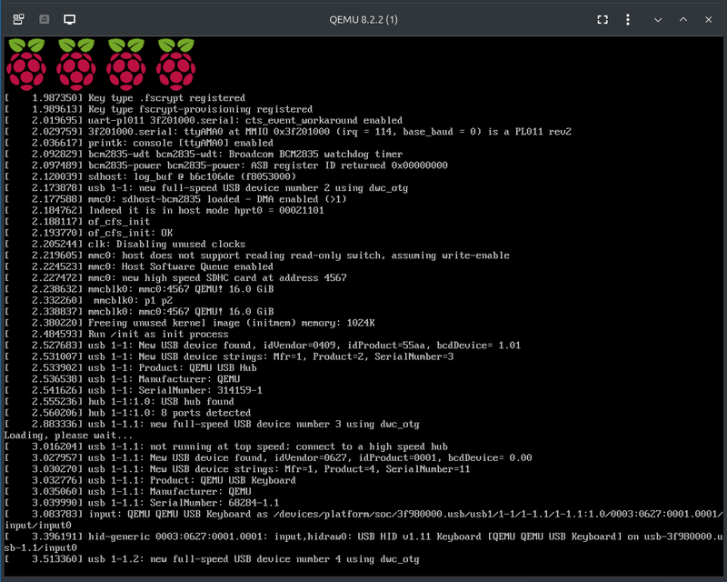
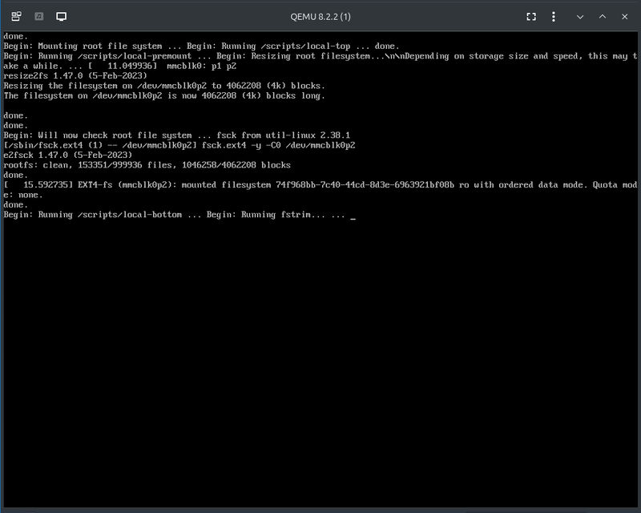
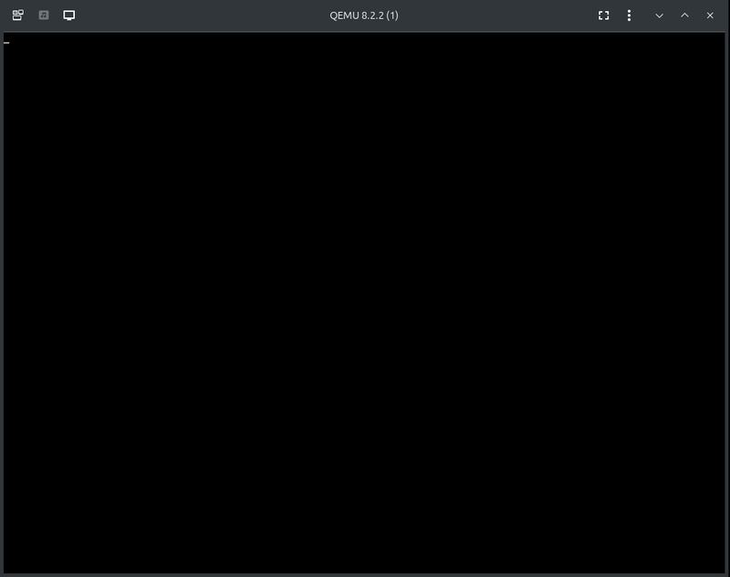
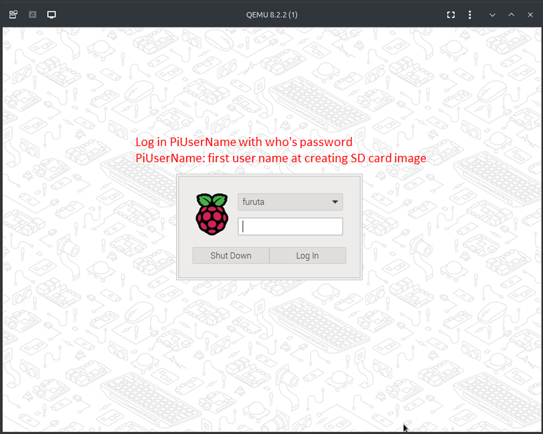
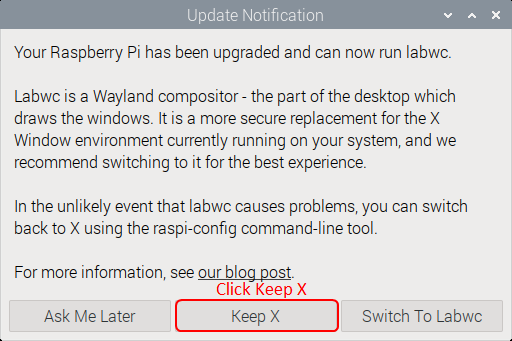
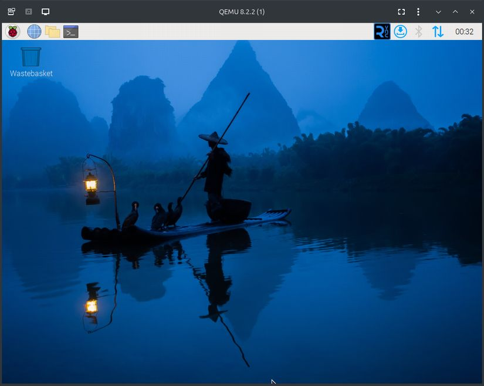

# Raspberry Pi OS の初期設定を行う

このページは次の設定を済ませた続きとして書かれています。

+ [Network Bridge を QEMU 向けに構成する](bridge.md)
+ [QEMU で実行する Rasiberry Pi image を作る](rpi-image.md)
 
ディレクトリ位置などの環境によって読み替える必要がある部分は「[手順中の読み換え内容](rpi-image.md#meta-symbols)」を参考にして下さい。

## 初期設定作業の流れ

Raspberry Pi OS の初期設定を次の様な流れで行います。

+ 1 回目の初期設定起動
  + 以下自動で行われます
    + SD card Image に格納した rootfs パーティション拡大
      + 処理時間を短縮する目的で既に実施済みですが、拡大処理が行われます。
    + SSH server host key 生成
    + (WPA の設定をする)
      + (国別電波帯設定)
    + PARTUUID を固有な値に変更する
+ 2 回目の初期設定起動
  + 以下自動で行われます
    + Host name 設定
    + SSH server 起動設定
    + User 設定
    + (WiFi SSID pass phrase 設定)
    + keyboard layout 設定
    + timezone 設定
+ 3 回目の初期設定起動
  + 起動中に rpi-first-boot-wizard ユーザーと(user name を変更しているのであれば) pi ユーザーを削除
  + 以下 [`/var/local/post-setup.sh`](../downloads/target/var/local/post-setup.sh) を使って設定します
    + 念のため /boot/firmware/firstrun.sh を削除
    + 念のため rpi-first-boot-wizard アカウントをロック
    + hciuart.service (bluetooth 経由のシリアルポートサービス)を停止
    + ModemManager.service を停止
    + rpi-eeprom-update.service を停止
  + 以下 `sudo `[`raspi-config-qemu.sh`](../downloads/target/var/local/raspi-config-qemu.sh) を使って設定します
    + GUI desktop にて user login を行う
    + Screen blanking をしない
    + Openbox window manager を X11 server で動作させる
      + frame buffer device を使うための設定
    + VNC server でリモートから GUI を操作できるようにする
      + QEMU の virtual machine display は SDL, GTK, spice, VNC いずれも keybind が合わない問題が出ます
+ 4 回目の初期設定起動
  + X11 server を使う設定
  + 以降そのまま利用できます

## 1 回目の初期設定起動と 2 回目の初期設定起動をします

current directory は /PathTo/RpiVMFiles です。[QEMU で実行する Rasiberry Pi image を作る](rpi-image.md) の続きの作業です。

qemu-system-arm を Raspberry Pi model 2B の構成で起動する [`./rpi2vm32-1st.sh`](../downloads/host/rpi2vm32-1st.sh), [`./rpi2vm32-2nd.sh`](../downloads/host/rpi2vm32-2nd.sh) を実行します。これらの script は自動的に script が配置されているディレクトリにある SD card image file *.img を見つけて qemu-system-arm に渡します。

```bash
# Here current directory is /PathTo/RpiVMFiles
# 1st run to configure Raspberry Pi OS.
./rpi2vm32-1st.sh
# Here you will see many console outputs.
# It takes 20 to 40 minutes to configure.
# The virtual Raspberry Pi machine will terminate.
# 2nd run to configure Raspberry Pi OS.
./rpi2vm32-2nd.sh
# Here you will see many console outputs.
# The virtual Raspberry Pi machine will terminate.
```

[`./rpi2vm32-1st.sh`](../downloads/host/rpi2vm32-1st.sh) を実行すると仮想 Raspberry Pi の画面ウインドウが表示されます。初期設定なので GUI 画面はでません。[`./rpi2vm32-2nd.sh`](../downloads/host/rpi2vm32-2nd.sh) も同様に GUI 画面はでません。



[`./rpi2vm32-1st.sh`](../downloads/host/rpi2vm32-1st.sh) を実行して 30 秒 ～ 2 分程度経過すると次の様な表示で止まったように見えます。空き領域の trim 処理をしています。20 ～ 30 分程度掛かります。

```text
Begin: Running /scripts/local-bottom ... Begin: Running fstrim... ... 
```



[`./rpi2vm32-2nd.sh`](../downloads/host/rpi2vm32-2nd.sh) 実行中に Raspberry Pi OS の shell prompt が出ますが、操作する必要はありません。QEMU が終了するまで待って下さい。

## 3 回目の初期設定起動

3 回目の初期設定起動は通常起動で使う script [`./rpi2vm32.sh`](../downloads/host/rpi2vm32.sh) で起動します。

```bash
# Here current directory is /PathTo/RpiVMFiles
# 3rd run to configure Raspberry Pi OS.
./rpi2vm32.sh
# Here you will see many console outputs.

My IP address is 192.168.0.xx 240f:6e:7f7:1:e953:14af:xxxx:xxxx

PiHostName login: PiUserName
Password:
## -- snip -- ##
# Run post setup script, it may take 10 minutes.
sudo /var/local/post-setup.sh
# Run Raspbery Pi utility setups, it may take 10 minutes.
sudo /var/local/raspi-config-qemu.sh
# Shutdown.
sudo /sbin/init 0
```

仮想 Raspberry Pi の画面ウインドウは左上でカーソルが点滅するだけになります。これは想定通りの動作です。



[`./rpi2vm32.sh`](../downloads/host/rpi2vm32.sh) を起動したコンソール画面でログインします。PiUserName は Raspberry Pi OS の SD card image を作成したときの user 名です。組みで設定した password を入力してログインします。続けて `sudo `[`/var/local/post-setup.sh`](../downloads/target/var/local/post-setup.sh) と `sudo `[`/var/local/raspi-config-qemu.sh`](../downloads/target/var/local/raspi-config-qemu.sh) を実行します。それぞれ 10 分程度掛かります。

途中次の様な systemd (DBUS) に関係するエラーが出ることがあります。処理は済んでいるので無視して下さい。

```text
Reload daemon failed: Connection timed out
Failed to disable unit: Transport endpoint is not connected
```

最後は sudo /sbin/init 0 で仮想 Raspberry Pi をシャットダウンします。

## 4 回目の初期設定起動

4 回目の初期設定起動は [`./rpi2vm32.sh`](../downloads/host/rpi2vm32.sh) を使います。3 回目の初期設定起動と同じ通常起動で使うスクリプトです。

```bash
# Here current directory is /PathTo/RpiVMFiles
# 4th run to configure Raspberry Pi OS.
./rpi2vm32.sh
# Here you will see many console outputs.
# Login on QEMU remote-viewer window.
# Click [Keep X] to configure using frame buffer.
```

5 ～ 8 分ほど待つと仮想 Raspberry Pi の画面ウインドウに GUI のログイン画面が現れます。途中半分くらいの時間は画面ウインドウは真っ黒なままです。

仮想 Raspberry Pi の画面ウインドウでログインします。ログインに使う User と Password は SD card image を作るときに設定した PiUserName とその password です。 



1 ～ 2 分程度待つと次の様な X11 window 環境を維持するか訪ねてくるダイアログがでます。[Keep X] をクリックします。これで frame buffer device を使うことを確定します(以降この質問は表示されなくなります)。



以降はキーボードレイアウトが正しくない問題がありますが GUI で操作できるようになります。正しいキーボードレイアウトで使う場合は [VNC で接続します](#vnc-connection)。



Raspberry Pi OS を更新すると _/PathTo/RpiVMFiles_/bootfs 以下の更新も必要になる場合があります。[apt upgrade をした後の対応](./follow-upgrade.md) で更新に追従する方法を説明します。

## 各種接続について

### 全般

Raspberry Pi OS は /etc/dhcp/dhclient.conf で dhcp-lease-time を指定していないので DHCP server が決めた lease time が IP address 割り当て時間となります。環境によっては 30 分 ～ 60 分程度で IP address が変わります。

### VNC connection

Raspberry Pi OS の service で VNC 接続できる様になっています。ユーザー名とパスワードを利用できる VNC client アプリケーションを使って下さい。[Remote access VNC (Raspberry Pi Documentation)](https://www.raspberrypi.com/documentation/computers/remote-access.html#vnc) を参考にして下さい。IP address PiHostName.local の様に .local 接尾辞を付けて、IP address を解決できるはずです。

> [!TIP]
> もし VNC 接続ができず仮想 Raspberry Pi 内の /var/log/vncserver-x11.log に次の様なログが残っていた場合は、
>
> ```text
> SAuthUserPasswd: Auth error: /: permissions are not restrictive enough
> ```
>
> Raspberry Pi OS の /, /etc, /etc/systemd, /etc/systemd/system, /etc/X11/, /etc/X11/xorg.conf.d, /var, /var/local directory の owner と permission が書き換わっています。「[起動に必要なファイルを image file からコピーし image file を修正する](rpi-image.md#tar-target-kit)」を正しく行えていない可能性があります。SD card image に書き込まれた通りの owner:group permission に修正すれば復旧できます。

### ssh connection

SSH server を有効にしているので `ssh PiUserName@PiHostName.local` で接続できようになっています。

## (参考) 仮想 Raspberry Pi のシリアルポートと標準入出力の操作について

### QEMU monitor 機能

QEMU 起動スクリプト [`./rpi2vm32-1st.sh`](../downloads/host/rpi2vm32-1st.sh), [`./rpi2vm32-2nd.sh`](../downloads/host/rpi2vm32-2nd.sh), [`./rpi2vm32.sh`](../downloads/host/rpi2vm32.sh), [`./rpi2vm32-vnc.sh`](../downloads/host/rpi2vm32-vnc.sh) のいずれも仮想 Raspberry Pi のシリアルポートを標準入出力に割り当てています。この標準入出力は QEMU の monitor 入出力も兼用しています。詳細は [Keys in the character backend multiplexer (QEMU documents)](https://www.qemu.org/docs/master/system/mux-chardev.html) と [QEMU monitor (QEMU documents)](https://qemu-project.gitlab.io/qemu/system/monitor.html) を参考にして下さい。次のキー入力は特殊な扱いになります。

|Type In|function|
|-------|--------|
|Ctrl-a h|Print this help.|
|Ctrl-a ?|Alternate to Ctrl-a h, print help.|
|Ctrl-a x|Exit emulator.|
|Ctrl-a s|Save disk data back to file (if -snapshot).|
|Ctrl-a t|Toggle console timestamps. Be aware, timestamp may overwritten by CR control code output.|
|Ctrl-a c|Switch between console and monitor.|
|Ctrl-a Ctrl-a|Sends Ctrl-a|

「`Ctrl-a x`」あるいは「`Ctrl-a c` の後で `quit` command を入力」は仮想マシンを強制終了する場合に使えます。動作が思わしくない場合に使える手段です。

### スクロール範囲・折り返しを整える

標準入出力に割り当てられたシリアルポートから仮想 Raspberry Pi を操作していると、スクロール範囲、折り返しに乱れが生じる場合があります。この場合は、シリアルポートからログインしている状態で、reset コマンドを実行して下さい。

```bash
reset
```

ssh でログインすると煩わしさはありません。

<a name="rpi2vm32-conf"></a>

## (参考) rpi2vm32.conf, rpi2vm32-vnc.conf を設定する

[`rpi2vm32.conf`](../downloads/host/rpi2vm32.conf) と [`rpi2vm32-vnc.conf`](../downloads/host/rpi2vm32-vnc.conf) は qemu-system-arm コマンドに渡すパラメータを設定するファイルです。修正しなくてもある程度動作する様にしてあります。自動的なパラメータ設定で上手くいかない場合は修正して下さい。

> [!TIP]
> qemu 起動スクリプトが rpi2vm32-vnc.sh の場合は拡張子 .sh の部分を .conf に置き換えたファイル rpivm32-vnc.conf が読み込まれます。

|shell variable|default value|description|
|--------------|-------------|-----------|
|KernelFile|bootfs/kernel7.img|-kernel オプションに渡すパラメータです。kernel image file を指定します。|
|InitrdFile|bootfs/initramfs7|-initrd オプションに渡すパラメータです。initrd image file を指定します。<sup>*1</sup>|
|DtbFile|bootfs/bcm2709-rpi-2-b.dtb|-dtb オプションに渡すパラメータです。Device Tree Blob file を指定します。|
|SdFile|\*.img|-drive オプションに渡すパラメータです。省略した場合は、スクリプトを配置してあるディレクトリから \*.img ファイルを探して設定値にします。<br>複数ある場合は昇順に並べて先に来る方を選択します。<br>ただし、大文字・小文字を無視して swap\*.img は対象外にします。SdFile を設定する場合は *.qcow2 形式も設定できる様にしてあります。|
|NicBridge|pickup one from bridges|-netdev オプションの br= に指定するパラメータです。<br>省略した場合は network bridge の中から一つ選びます。複数ある場合は NicBridge を設定して望ましい network bridge を指定して下さい。|
|NicMac||仮想 Raspberry Pi マシンに接続する USB Ether network デバイスの MAC address を指定します。省略した場合は \${NicMacFile} から読み取るか、\${NicMacPrefix} から自動生成します。|
|NicMacFile|net0_mac.txt|仮想 Raspberry Pi マシンに接続する USB network デバイスの MAC address を保存する(保存してある)ファイルを指定します。<br>ファイルが存在しない場合は NicMacPrefix を OUI (上位 3 octed) として自動生成を試み、生成した結果が格納されます。 |
|NicMacPrefix|b8:27:eb|仮想 Raspberry Pi マシンに接続する USB Ether network デバイスの MAC address を自動生成する場合に OUI (上位 3 octed) として使う値を指定します。b8:27:eb は Raspberry Pi に使われる値です。|
|DisplayOutput|spice-app|仮想 Raspberry Pi マシンの画面を表示する方法を指定します。<br>"spice-app" : remote-viewer アプリケーションでウインドウ表示(既定)<br>"gtk" : 操作メニュー付きウインドウで表示<br>"sdl" : 単に表示だけするウインドウで表示<br>spice-app は独立したプロセスで表示する動作になっているのでウインドウを閉じても仮想マシンは動き続けます。gtk, sdl はウインドウを閉じると仮想マシンは終了します。|
|VncDisplay||rpi2vm32-vnc.sh で使われるパラメータです。QEMU エミュレータで画面表示を見るため VNC server を動かす場合に接続を受け付ける socket interface を指定します。<br>"unix:/" または指定無し : UNIX domain socket 接続を受け付けます。スクリプトの拡張子を .sock に変えた path が node になります。<br>"unix:/path/to/socket" : /path/to/socket ノードで UNIX domain socket 接続を受け付けます。<br>":\*" : 空きディスプレイ番号を 10 .. 99 (ポート番号換算で 5910 .. 5999) の間で探し、そのポートに対する接続を受け付けます。空きポートを探したい場合はポート番号を \* にして下さい。<br>":display_number" : ディスプレイ番号 display_number (ポート番号換算で display_number+5900) に対する接続を受け付けます。<br>"interface_address:display_number" : interface_address で指定した network interface でディスプレイ番号 display_number (ポート番号換算で display_number+5900) に対する接続を受け付けます。例えば "localhost:10" は localhost 内でポート 5910 に対する接続を受け付けます。|

> <sup>*1</sup> QEMU 上で Raspberry Pi OS を動かす他の例では initrd file を指定しない方法が見られます。initrd file 指定無しでも動作しますが、指定した場合と違った動作をします。

## (参考) rpi2vm32.sh 概要

qemu-system-arm を呼び出すスクリプト [`rpi2vm32.sh`](../downloads/host/rpi2vm32.sh) と初期設定用スクリプト群の概要を説明します。修正して様々な起動形態を派生させる参考にして下さい。

### 共通部分 rpi2vm32-common.sh 取り込み

[`rpi2vm32-1st.sh`](../downloads/host/rpi2vm32-1st.sh), [`rpi2vm32-2nd.sh`](../downloads/host/rpi2vm32-2nd.sh), [`rpi2vm32.sh`](../downloads/host/rpi2vm32.sh), [`rpi2vm32-vnc.sh`](../downloads/host/rpi2vm32-vnc.sh) スクリプトの共通部分を [`rpi2vm32-common.sh`](../downloads/host/rpi2vm32-common.sh) にまとめてあります。

次の様な規則で [`rpi2vm32-common.sh`](../downloads/host/rpi2vm32-common.sh) の配置場所を特定しています。

1. スクリプトの \$0 (コマンドラインから呼び出した時に使った path あるいはコマンド名) から、配置されたディレクトリを探す
2. スクリプトの basename 部分より接尾辞(拡張子部分) .sh を除く
3. 上記で得た部分文字列から最長末尾一致でパターン -\* を削除する
4. 1 で得た文字列と 3 で得た文字列を / で結合し、末尾に -common.sh を結合する

カレントディレクトリが /PathTo/RpiVMFiles だった場合の例をいくつか示します。rpi2vm32.sh をリネームした場合の参考にして下さい。

|renamed?|invoke|common file path|
|------|-------|-----------|
|no|[./rpi2vm32-1st.sh](../downloads/host/rpi2vm32-1st.sh)|/PathTo/RpiVMFiles/rpi2vm32-common.sh|
|no|[./rpi2vm32.sh](../downloads/host/rpi2vm32-2nd.sh)|/PathTo/RpiVMFiles/rpi2vm32-common.sh|
|yes|./rpi2vm32-1280x1024.sh|/PathTo/RpiVMFiles/rpi2vm32-common.sh|
|yes|./rpi2vm32-with-swap.sh|/PathTo/RpiVMFiles/rpi2vm32-common.sh|
|yes|./raspios32.sh|/PathTo/RpiVMFiles/raspios32-common.sh|

### `rpi2vm32-1st.sh` と `rpi2vm32-2nd.sh` の .conf ファイル読み取り

[`rpi2vm32-1st.sh`](../downloads/host/rpi2vm32-1st.sh), [`rpi2vm32-2nd.sh`](../downloads/host/rpi2vm32-2nd.sh) スクリプトは設定ファイル [`rpi2vm32.conf`](../downloads/host/rpi2vm32.conf) を読み取って qemu-system-arm に渡す引数を決めています。

次の様な規則で [`rpi2vm32.conf`](../downloads/host/rpi2vm32.conf) の配置場所を特定しています。

1. スクリプトの \$0 引数 (コマンドラインから呼び出した時に使った path あるいはコマンド名) から、配置されたディレクトリを探す
2. スクリプトの basename 部分より接尾辞(拡張子部分) .sh を除く
3. 2 で得た文字列から最短末尾一致でパターン -* を削除する
4. 1 で得た文字列と 3 で得た文字列を / で結合し、末尾に .conf を結合する

カレントディレクトリが /PathTo/RpiVMFiles だった場合の例をいくつか示します。rpi2vm32.sh をリネームした場合の参考にして下さい。

|renamed?|invoke|common file path|
|------|-------|-----------|
|no|[./rpi2vm32-1st.sh](../downloads/host/rpi2vm32-1st.sh)|/PathTo/RpiVMFiles/rpi2vm32.conf|
|yes|./rpi2vm32-1280x1024-1st.sh|/PathTo/RpiVMFiles/rpi2vm32-1280x1024.conf|
|yes|./raspios32-1st.sh|/PathTo/RpiVMFiles/raspios32.conf|

### `rpi2vm32.sh` と `rpi2vm32-vnc.sh` の .conf ファイル読み取り

[`rpi2vm32.sh`](../downloads/host/rpi2vm32.sh) ([`rpi2vm32-vnc.sh`](../downloads/host/rpi2vm32-vnc.sh)) スクリプトは設定ファイル [`rpi2vm32.conf`](../downloads/host/rpi2vm32.conf) ([`rpi2vm32-vnc.conf`](../downloads/host/rpi2vm32-vnc.conf)) を読み取って qemu-system-arm に渡す引数を決めています。

次の様な規則で [`rpi2vm32.conf`](../downloads/host/rpi2vm32.conf) ([`rpi2vm32-vnc.conf`](../downloads/host/rpi2vm32-vnc.conf)) の配置場所を特定しています。

1. スクリプトの \$0 引数 (コマンドラインから呼び出した時に使った path あるいはコマンド名) から、配置されたディレクトリを探す
2. スクリプトの basename 部分より接尾辞(拡張子部分) .sh を除く
3. 1 で得た文字列と 2 で得た文字列を / で結合し、末尾に .conf を結合する

カレントディレクトリが /PathTo/RpiVMFiles だった場合の例をいくつか示します。rpi2vm32.sh をリネームした場合の参考にして下さい。

|renamed?|invoke|common file path|
|------|-------|-----------|
|no|[./rpi2vm32.sh](../downloads/host/rpi2vm32.sh)|/PathTo/RpiVMFiles/rpi2vm32.conf|
|no|[./rpi2vm32-vnc.sh](../downloads/host/rpi2vm32-vnc.conf)|/PathTo/RpiVMFiles/rpi2vm32-vnc.conf|
|yes|./rpi2vm32-with-swap.sh|/PathTo/RpiVMFiles/rpi2vm32-with-swap.conf|
|yes|./raspios32.sh|/PathTo/RpiVMFiles/raspios32.conf|

### qemu-system-arm 起動

[`rpi2vm32.sh`](../downloads/host/rpi2vm32.sh) から [`qemu-system-arm`](https://qemu-project.gitlab.io/qemu/system/invocation.html) を実行している次の部分について概要を説明します。

```bash
qemu-system-arm \
-machine raspi2b \
-kernel "${KernelFile}" \
-initrd "${InitrdFile}" \
-dtb "${DtbFile}" \
-drive "${_DriveParam}" \
-append "console=ttyAMA0,115200 console=tty1\
 root=/dev/mmcblk0p2 rootfstype=ext4 fsck.repair=yes rootwait\
 dwc_otg.fiq_fsm_enable=0\
 bcm2708_fb.fbwidth=1024 bcm2708_fb.fbheight=768\
" \
-serial mon:stdio \
-no-reboot \
-device usb-kbd \
-device usb-tablet \
-netdev "tap,br=${NicBridge},helper=/usr/lib/qemu/qemu-bridge-helper-suid,id=net0" \
-device "usb-net,netdev=net0,mac=${NicMac}" \
-display "${DisplayOutput}" \
"$@"
```

`qemu-system-arm` に渡すオプションは次の通りです。

+ -machine
  + raspi2b<br>
    仮想マシンを Raspberry Pi Model 2B にします。
+ -kernel
  + "\${KernelFile}"<br>
    kernel image ファイルを指定します。bootfs/kernel7 は Raspberry Pi OS 32bit の kernel です。
+ -initrd
  + "\${InitrdFile}"<br>
    initrd image ファイルを指定します。bootfs/initramfs7 は Raspberry Pi OS 32bit の initrd です。<br>このオプションを指定しない例を多く見掛けます。指定しなくても動作しますが、動作に差異が見られます。実機通り initrd の実行を経た動作にします。
+ -dtb
  + "\${DtbFile}"<br>
    Device Tree Blob ファイルを指定します。bootfs/bcm2709-rpi-2-b.dtb は Raspberry Pi Model 2B の Device Tree です。
+ -drive
  + "\${\_DriveParam}"<br>
    \${\_DriveParam} は \${SdFile} に format= パラメータを補った文字列です。file コマンドでファイルを調べて FDISK 形式であれば format=raw、QCOW2 形式であれば format=qcow2 を付けます。<br>SD card イメージファイルに QCOW2 形式を使う場合は SdFile 変数を設定して下さい。
+ -append
  + console=ttyAMA0,115200 console=tty1<br>
    シリアルポート(ホストマシンの標準入出力)と仮想端末画面 tty1 に kernel log を出力します。
  + root=/dev/mmcblk0p2<br>
    SD card の第 2 パーティションを / にマウントします。Raspberry Pi Imager が作った cmdline.txt では PARTUUID で指定しています。MMC 系統の block device の入れ替え・付け外しは行わないので直接ノード指定にしてあります。
  + fsck.repair=yes<br>
    必要であればマウント前に fsck による修復を行います。
  + rootwait<br>
    マウントを始める前に block device が動き出すのを待ちます。仮想マシンなので指定が無くても大丈夫なはずですが、確認ができていないので付けてあります。
  + dwc_otg.fiq_fsm_enable=0<br>
    DWC2 USB OTG controller の Host 機能制御に FIQ 割り込みを使わない様に指定します。FIQ 割り込みは主に isochronous 転送のパケット損失を減らす目的で使っているはずですが、UAC, UVC などの Audio, Video stream USB device を動作させる予定はありません。また Raspberry Pi 実機でも古い kernel では不意のリブートを起こしているなど不安定要因になっています。FIQ 割り込みは使わないことにします。
  + bcm2708_fb.fbwidth=1024 bcm2708_fb.fbheight=768<br>
    仮想 Raspberry Pi マシンのフレームバッファ解像度を 1024x768 にします。この設定は Raspberry OS の rootfs パーティション内にある /etc/X11/xorg.conf.d/01-screen.conf の設定と整合している必要があります。
+ -serial
  + mon:stdio<br>
    仮想 Raspberry Pi のシリアルポート入出力を標準入出力に繋げます。同時に QEMU monitor と多重化します。
+ -no-reboot<br>
  仮想マシン内から reboot を行った場合、QEMU emulator を終了します。-no-reboot は必須ではありません。
+ -device
  + usb-kbd<br>
    USB keyboard (HID) を接続します。
+ -device
  + usb-tablet<br>
    USB tablet (HID) を接続します。
+ -netdev
  + tap<br>
    仮想 bridge に仮想 tap device を接続する方式を使います。
  + br=\${NicBridge}<br>
    仮想 bridge を指定します。 
  + helper=/usr/lib/qemu/qemu-bridge-helper-suid<br>
    仮想 brdife に接続するための helper program を指定します。 qemu-bridge-helper-suid は予め準備しておく必要が有ります。[QEMU のネットワーク設定 helper を root 権限昇格できる様にする](bridge.md#setup-qemu-bridge-helper) を参照してください。
  + id=net0<br>
    一連の設定に net0 という名前を付けます。
+ -device
  + usb-net<br>
    上記の -netdev で構成した network 接続を USB-Ethernet で接続します。
  + netdev=net0<br>
    上記の -netdev で構成した network 接続を net0 で指定します。
  + mac=\${NicMac}<br>
    MAC address を指定します。[(参考) rpi2vm32.conf を設定する - rpi2vm32.sh 概要](#rpi2vm32-conf)を参照して下さい。
+ -display
  + \${DisplayOutput}<br>
    仮想 Raspberry Pi マシンの画面出力ウインドウ表示方式を指定します。
+ -vnc
  + \${VncDisplay}<br>
    rpi2vm32-vnc.sh で qemu-system-arm に渡している引数です。[(参考) rpi2vm32.conf を設定する - rpi2vm32.sh 概要](#rpi2vm32-conf)を参照して下さい。
