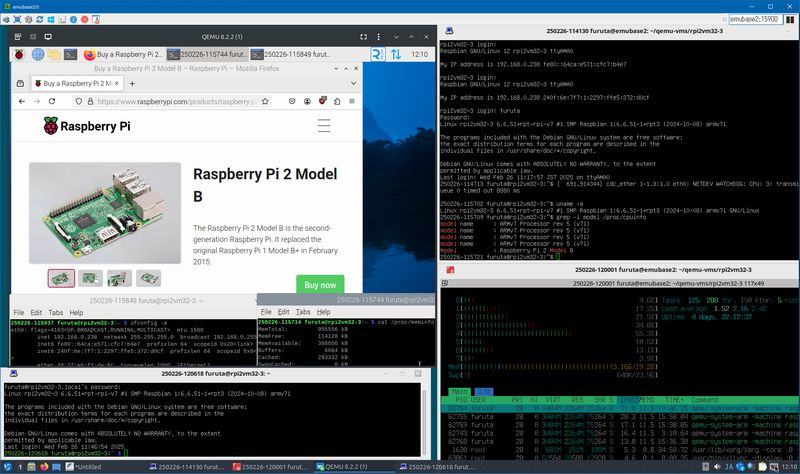

# QEMU で実行する Rasiberry Pi イメージファイルをスクリプトを使って作る

## はじめに

Linux の QEMU で実行する Raspberry Pi イメージファイルをスクリプトを使って作ります。Super Speed USB 接続の USB card reader を使い 8Gbyte の SD Card イメージから作った場合、おおよそ 5 分ほどで完了します。

出来上がったイメージファイルは次の様な環境で動いて機能します。

+ Raspberry Pi OS 32bit のイメージファイルの実行環境・機能
  + Raspberry Pi model 2B
    + `-machine raspi2b` を使います
  + シリアルコンソール
+ Raspberry Pi OS 64bit のイメージファイルの実行環境・機能
  + Raspberry Pi model 3B
    + `-machine raspi3b` を使います
  + シリアルコンソール
    + Device Tree Blob を修正して使える様にしてあります
+ 32bit/64bit 共通の実行環境・機能
  + QEMU はなるべく新しい版、Ubuntu 24.04 派生に含まれるパッケージを推奨
    + Ubuntu 24.04 またはこれの派生を使うことを推奨します
  + ネットワーク外部接続可
    + USB-Ethernet converter エミュレーション
    + 起動スクリプトの設定で実現しています
  + GUI デスクトップ
    + QEMU の Frame Buffer を使います
    + VNC 接続可
  + GPIO, I2C, SPI などのハードウエアは使わない

ホストマシンの最低スペックは次の通りです。64bit Linux 環境であれば Raspberry Pi OS 64bit の方が速い動きをします。

|Item|Required Spec.|Description|
|----|--------------|-----------|
|CPU|Core i3-2120T|2 Core 4 Thread, Base Clock 2.60GHz で何とか使える程度に動きます。ホストマシン操作も「やや重い」印象が出ます。|
|RAM|4Gibyte|このうち 2.32 Gibyte 程(実測値)を QEMU で使います。|
|Storage|HDD 33Gibytes|HDD で十分動作します。swap を別途設けるのであれば 35Gibyte 程必要になります。|
|OS|Ubuntu 24.04|QEMU 7.2.0 以上をパッケージリポジトリから提供するディストリビューションを必要とします。|



[上記の等倍イメージ](../img/rpi2-rpios-32bit-on-linux.png)

[手作業でイメージファイルを作る場合は「QEMU で実行する Rasiberry Pi イメージファイルを作る」を参照して下さい](rpi-image.md)(注: 参照先の手順に Device Tree Blob を修正する手順は含まれていません)。

## Raspberry Pi OS 32/64bit SD card イメージファイルを作る

Raspberry Pi OS image を格納したメディアを次の設定で作ります。

### Raspberry Pi OS 32bit の場合

+ Raspberry Pi 2
+ Raspberry Pi OS (32-bit)
+ イメージを格納する先は SD card
  + USB memory でも可
  + 8Gbyte 以上の媒体を使って下さい


### Raspberry Pi OS 64bit の場合

+ Raspberry Pi 3
+ Raspberry Pi OS (64-bit)
+ イメージを格納する先は SD card
  + USB memory でも可
  + 8Gbyte 以上の媒体を使って下さい


[Raspberry Pi Imager](https://www.raspberrypi.com/software/) をダウンロード・インストール・実行して下さい。詳細なやり方はのリンク先を参照して下さい。

設定を編集します。


「一般」を次の様に編集します。

+ ホスト名を設定します(後ほど PiHostName と表記します)
+ ユーザー名(後ほど PiUserName と表記します)とパスワードを設定します
+ Wi-Fi は設定しません
+ ロケールは使用する地域に合わせて下さい
  + キーボードレイアウトは VNC viewer (client) のキーボードレイアウトに関係なく us を選んだ方が良いです
  + 入力がおかしい場合は `sudo raspi-config` を使い 5 Localisation Options - L3 Keyboard で設定変更が後からできます


「サービス」を次の様に編集します。

+ SSH を有効にします
  + パスワード認証を使う


編集を終えて SD card に書き込みます。


## Linux 上で QEMU を準備する

Linux PC でこの作業手順で使うコマンドと QEMU を使えるように準備します。

```bash
# Install QEMU and support utilities
#  Download tool(curl), Network Bridge tools, 
#  Emulators, QEMU Imager,
#  Partition manipulation tools,
#  Network Block Device tools, ExtX File System resizer tools,
#  ExtX check tools, VNC viewer, and Device Tree Compiler
sudo apt install curl bridge-utils uml-utilities \
 qemu-system-common qemu-system qemu-system-arm qemu-utils \
 parted nbd-client cloud-guest-utils e2fsprogs virt-viewer \
 device-tree-compiler
```

## Raspberry Pi OS SD card image を file image に変換する

<a name="meta-symbols"></a>

### 手順中の読み換え内容

書き終わった SD card を Linux PC に接続して、SD card イメージファイルを作成します。QEMU で実行するために必要な書き換えはスクリプト [rpi3image.sh](../downloads/host/rpi3image.sh) が全て行います。

|symbol|example|description|
|------|-------|-----------|
|_/dev/sdX_|/dev/sdg|SD card の device path です。他の SATA, USB, SCSI ドライブなどの SCSI ドライブに抽象化された器機の状況によって変わります。`rpi3image.sh find` で探すこともできます。|
|_PiHostName_|rpi3vm64-000|Raspberry Pi OS の host 名です。[Raspberry Pi OS の初期設定を行う](config-rpi-64.md)で参照します。|
|_PiUserName_|furuta|Raspberry Pi OS に作ったアカウントのユーザー名です。[Raspberry Pi OS の初期設定を行う](config-rpi-64.md)で参照します。|
|_UserName_|furuta|QEMU を使おうとするユーザー名です。|
|_/PathTo/RpiVMFiles_|/home/furuta/qemu-vms/rpi3vm|仮想 Raspberry Pi  を動かすために必要なファイル群を配置するディレクトリです。NVMe, SATA 接続など直結していて安定したアクセスが可能なストレージ上に配置することを推奨します。|
|_raspios-Bits-SerialNumber.img_|raspios-64-0000.img|SD card から変換した Raspberry Pi OS イメージファイルです。|
|_/DownLoaded_|/home/furuta/git/qemu-raspberrypi/downloads|[rpios32bit-target-kit.tar.gz](../downloads/rpios32bit-target-kit.tar.gz), [rpios32bit-host-kit.tar.gz](../downloads/rpios32bit-host-kit.tar.gz), [rpios64bit-host-kit.tar.gz](../downloads/rpios64bit-host-kit.tar.gz) をダウンロードしたディレクトリです。この git repository を clone した場合は _git_cloned_base_/downloads になります。|

### SD card image を読み取る

Raspberry Pi OS イメージファイルとスクリプトを格納する作業ディレクトリ _/PathTo/RpiVMFiles_ を作ります。

```bash
# Create directory to store Raspberry Pi VM files and scripts.
mkdir -p /PathTo/RpiVMFiles
cd /PathTo/RpiVMFiles
# Only owner can read/write/execute(change to directory) this directory.
chmod 700 .
```

イメージファイルを作るスクリプトと起動するスクリプトを格納した `*.tar.gz` ファイルを作業ディレクトリ内にコピーして展開します。次の様に Raspberry Pi OS が対応する CPU アーキテクチャ(データビット数)に合わせて選択します。

|OS bits (CPU arch)|download script files (in .tar.gz)|
|------------------|----------------------------------|
|32|[rpios32bit-host-kit.tar.gz](../downloads/rpios32bit-host-kit.tar.gz), [rpios32bit-target-kit.tar.gz](../downloads/rpios32bit-target-kit.tar.gz)|
|64|[rpios64bit-host-kit.tar.gz](../downloads/rpios64bit-host-kit.tar.gz), [rpios32bit-target-kit.tar.gz](../downloads/rpios32bit-target-kit.tar.gz)|

> [!TIP]
> 32bit, 64bit OS の両方で [rpios32bit-target-kit.tar.gz](../downloads/rpios32bit-target-kit.tar.gz) を使います。

#### Raspberry Pi OS 32bit の場合

```bash
# Download host kit
curl -OL https://github.com/Akinori-Furuta/qemu-raspberrypi/raw/refs/heads/master/downloads/rpios32bit-host-kit.tar.gz
# Download target kit, keep .tar.gz archive
curl -OL https://github.com/Akinori-Furuta/qemu-raspberrypi/raw/refs/heads/master/downloads/rpios32bit-target-kit.tar.gz
# Extract files from Raspberry Pi OS 32bit host kit .tar.gz file
tar xvf rpios32bit-host-kit.tar.gz
```

#### Raspberry Pi OS 64bit の場合

```bash
# Download host kit
curl -OL https://github.com/Akinori-Furuta/qemu-raspberrypi/raw/refs/heads/master/downloads/rpios64bit-host-kit.tar.gz
# Download target kit (same as 32bit target kit), keep .tar.gz archive
curl -OL https://github.com/Akinori-Furuta/qemu-raspberrypi/raw/refs/heads/master/downloads/rpios32bit-target-kit.tar.gz
# Extract files from Raspberry Pi OS 64bit host kit .tar.gz file
tar xvf rpios64bit-host-kit.tar.gz
```

32bit OS, 64bit OS どちらの場合も SD card からイメージファイルを作るスクリプトは `rpi3image.sh` です。

Raspberry Pi OS を格納した SD card を USB card reader に差し込み、Linux PC に接続します。次の様に `./rpi3image.sh find` を実行して SD card がある block device を探します。root 権限を必要とするので、パスワードを入力して下さい。

```bash
# Extract files from Raspberry Pi OS 64bit host kit .tar.gz file
./rpi3image.sh find
```

次の様な入出力になります。

```text
rpi3image.sh: INFO: Use temporary directory "/run/user/1000/rpi3image-151515-YDir2ch3vR".
[sudo] password for UserName: INPUT_YOUR_PASSWORD
./rpi3image.sh.BlockDeviceIsRaspiOS(): INFO: Not a Raspberry Pi OS image media "/dev/sda".
./rpi3image.sh.BlockDeviceIsRaspiOS(): INFO: Not a Raspberry Pi OS image media "/dev/sdb".
rpi3image.sh: INFO: Found Raspberry Pi OS image media at "/dev/sdc".
rpi3image.sh: INFO: DEV_PATH="/dev/sdc"
rpi3image.sh: INFO: /dev/sdc.VENDOR="Prolific Technology Inc."
rpi3image.sh: INFO: /dev/sdc.MODEL="SD Card Reader  "
rpi3image.sh: INFO: /dev/sdc.SIZE=14.7Gi/15.8G bytes
```

上記の例では /dev/sdc に Raspberry Pi OS を格納した SD card が見つかっています。SD card reader の製造元(VENDOR)、型番(MODEL)、SD card の容量(SIZE) が一致しているか確認して下さい。複数の Raspbery Pi OS を格納した SD card が存在する場合は、それぞれを見つけます。

状況によって次の様なパッケージが足りないメッセージが表示されます。パッケージをインストールして下さい。次の例は `sudo apt install cloud-guest-utils qemu-utils nbd-client device-tree-compiler` を実行してパッケージを追加する必要があります。 

```text
./rpi3image.sh: INFO: Need following package(s).
./rpi3image.sh: INFO:   cloud-guest-utils qemu-utils nbd-client device-tree-compiler
./rpi3image.sh: HELP: To install package(s), run following command.
./rpi3image.sh: HELP:   sudo apt install cloud-guest-utils qemu-utils nbd-client device-tree-compiler
```

SD card を読み取りイメージファイルを作成します。_/dev/sdX は `./rpi3image.sh find` などで見つけたブロックデバイスのパス(例えば /dev/sdc)を指定して下さい。

```bash
# Read SD card image, create image file and device tree blobs
./rpi3image.sh /dev/sdX
```

> [!TIP]
> 既に作業ディレクトリ _/PathTo/RpiVMFiles_ 内にイメージファイル、bootfs/ ディレクトリが存在する場合は上書きオプション `-f` を指定して下さい。
>
> ```bash
> # To overwrite exsisting files and directorys, use '-f' option
> ./rpi3image.sh -f /dev/sdX
> ```
>
> イメージファイルサイズは読み取った SD card の容量より大きく 2<sup>n</sup> で表せる最小のサイズに自動的に調整されます。ファイルサイズをより大きくする(rootfs パーティションの空き容量を増やす)には `-s ImageFileSizeInGbyte` オプションで Gibyte 単位でサイズを指定します。次の例はイメージファイルサイズを 32Gibyte にします。
>
> ```bash
> # To create more larger image file (more larger free space in rootfs),
> # use '-s ImageFileSizeInGbyte' option
> ./rpi3image.sh -s 32 /dev/sdX
> ```

`rpi3image.sh` 実行中は root 権限を必要とする場合にパスワードを入力する以外の対話入力はありません。実行時間の殆どは SD card を読み取る時間です。

OS が対応する CPU ビット数毎の出力ファイルは次の様になります。他にも bootfs/ ディレクトリの下に多数のファイルが配置されます。NNNN の部分は重複しないように付けられた連番です。

|OS bits|image file pattern|image file name example|Device Tree Blob|
|-------|------------------|-----------------------|----------------|
|32|raspios-32-NNNN.img|raspios-32-0000.img|bootfs//bcm2709-rpi-2-b.dtb|
|64|raspios-64-NNNN.img|raspios-64-0000.img|bootfs/bcm2710-rpi-3-b-qemu.dtb|

次はRaspberry Pi OS の初期設定を行います。OS が対応する CPU ビット数に合わせて進んで下さい。

+ [Raspberry Pi OS 32 bit の場合](config-rpi.md)
+ [Raspberry Pi OS 64 bit の場合](config-rpi-64.md)
