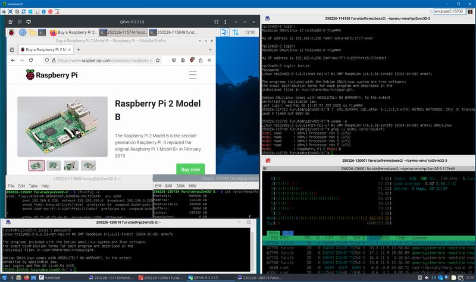
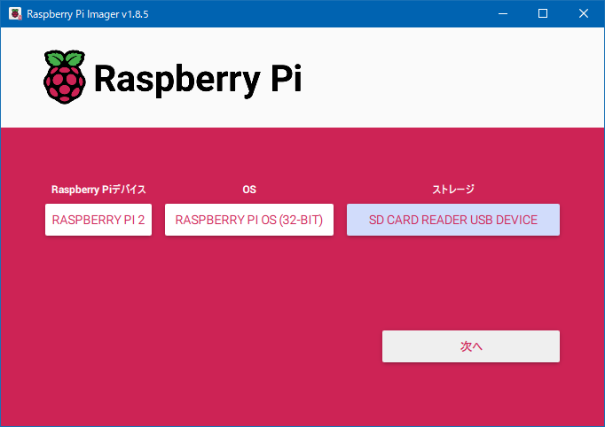
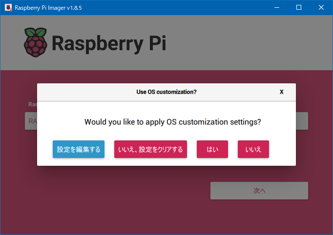
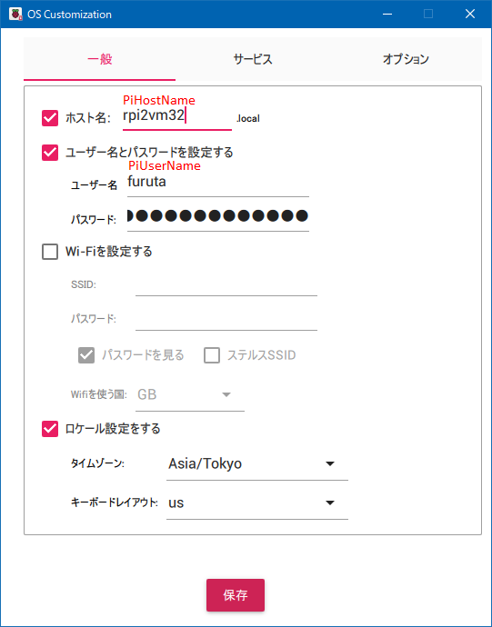
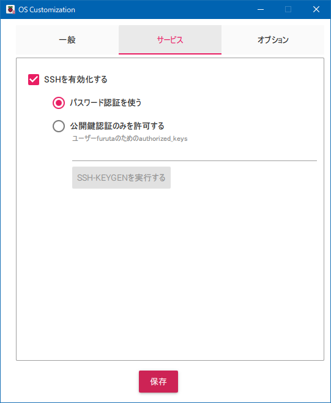
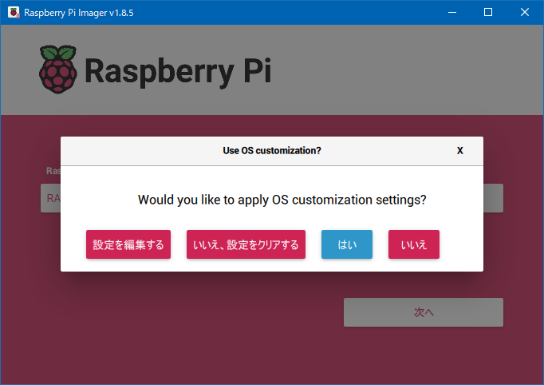

# QEMU で実行する Rasiberry Pi イメージファイルを作る

## はじめに

Linux の QEMU で実行する Raspberry Pi イメージファイルを次の様な動作目標で作ります。

+ Raspberry Pi model 2B
  + TCG エミュレーション
  + `-machine raspi2b` を使います
+ Raspberry OS 32bit
  + 64bit 版を動作させるには device tree blob ファイルを修正する必要があります
+ Raspberry Pi のシリアルポートをホストマシンの標準入出力へ繋ぎます
+ GUI 利用可能
  + keyboard, tablet を USB device でエミュレーション
  + 正しいキーボードレイアウトで使う場合は仮想 Raspberry Pi マシンに VNC で接続します
+ ネットワーク外部接続可
  + USB-Ethernet converter エミュレーション
+ GPIO, I2C, SPI などのハードウエアは使わない
+ QEMU はなるべく新しい版、Ubuntu 24.04 派生に含まれるパッケージを推奨
  + Ubuntu 24.04 またはこれの派生を使うことを推奨します
  + Ubuntu 22.04 の QEMU 6.2.0 は frame buffer が動作しません
  + 手元で動作確認ができている最も古い版は QEMU 7.2.0
    + ソースコードより構築しています


ホストマシンの最低スペックは次の通りです。

|Item|Required Spec.|Description|
|----|--------------|-----------|
|CPU|Core i3-2120T|2 Core 4 Thread, Base Clock 2.60GHz で何とか使える程度に動きます。ホストマシン操作も「やや重い」印象が出ます。|
|RAM|4Gibyte|このうち 2.32 Gibyte 程(実測値)を QEMU で使います。|
|Storage|HDD 33Gibytes|HDD で十分動作します。swap を別途設けるのであれば 35Gibyte 程必要になります。|
|OS|Ubuntu 24.04|QEMU 7.2.0 以上をパッケージリポジトリから提供するディストリビューションを必要とします。|


[上記の等倍イメージ](../img/rpi2-rpios-32bit-on-linux.png)

スクリプト化できそうですが、このページでは手作業で進めます。

## Raspberry Pi OS 32bit SD card イメージファイルを作る

Raspberry Pi image を次の設定で作ります。

+ Raspberry Pi 2
+ Raspberry Pi OS (32-bit)
+ SD card と card reader
  + USB memory でも可
  + 8Gbyte, 16Gbyte, または 32Gbyte の媒体を使って下さい

> [!NOTE]
> この先 8Gbyte, 16Gbyte, または 32Gbyte どの媒体を使っても、仮想 SD card イメージファイルのサイズを拡張します。進んだ先でイメージファイルの拡張方法とサイズについて詳細を説明します。



設定を編集します。



「一般」を次の様に編集します。

+ ホスト名を設定します(後ほど PiHostName と表記します)
+ ユーザー名(後ほど PiUserName と表記します)とパスワードを設定します
+ Wi-Fi は設定しません
+ ロケールは使用する地域に合わせて下さい
  + キーボードレイアウトは VNC viewer (client) のキーボードレイアウトに関係なく us を選んだ方が良いです
  + 入力がおかしい場合は `sudo raspi-config` を使い 5 Localisation Options - L3 Keyboard で設定変更が後からできます



「サービス」を次の様に編集します。

+ SSH を有効にします
  + パスワード認証を使う



編集を終えて SD card に書き込みます。



## Linux 上で QEMU を準備する

Linux PC で QEMU を使えるように準備します。

```bash
# Install QEMU and support utilities
#  Network Bridge tools, QEMU Imager, Emulators,
#  Partition manipulation tools, Network Block Device tools,
#  ExtX File System resizer tools, ExtX check tools,
#  VNC viewer, and Device Tree Compiler
sudo apt install bridge-utils uml-utilities qemu-system-common qemu-system qemu-system-arm qemu-utils parted nbd-client cloud-guest-utils e2fsprogs virt-viewer device-tree-compiler
```

> [!NOTE]
> `device-tree-compiler` は Raspberry Pi OS 64bit を動かすために使う予定です。

## Raspberry Pi OS SD card image を file image に変換する

### 手順中の読み換え内容

<a name="meta-symbols">書き終わった SD card を Linux PC に接続して、SD card イメージファイルを作成し、内容を修正します。以下次の様に実際の環境に応じた読み換えをして下さい</a>。

|symbol|example|description|
|------|-------|-----------|
|/dev/sdX|/dev/sdg|SD card の device path です。他の SATA, USB, SCSI ドライブなどの SCSI ドライブに抽象化された器機の状況によって変わります。|
|/dev/sdX1|/dev/sdg1|SD card の 第 1 パーティションです。bootfs パーティションになります。|
|/dev/sdX2|/dev/sdg2|SD card の 第 2 パーティションです。rootfs パーティションになります。|
|/dev/nbdN|/dev/nbd0|SD card から読み取ったイメージを block device として扱う path です。Network Block Device を使っていなければ /dev/nbd0 が使えますが、/dev/nbd0 が使用中であれば /dev/nbd1, /dev/nbd2, ... の様な代わりの path を使って下さい。|
|/dev/nbdNp1|/dev/nbd0p1|/dev/nbdN の 第1 パーティションです。bootfs パーティションになります。|
|/dev/nbdNp2|/dev/nbd0p2|/dev/nbdN の 第2 パーティションです。rootfs パーティションになります。|
|/mnt/nbdNp1|/mnt/nbd0p1|第1 パーティションの mount point です。|
|/mnt/nbdNp2|/mnt/nbd0p2|第2 パーティションの mount point です。|
|UserName|furuta|QEMU を使おうとするユーザー名です。|
|PiHostName|rpi2vm32|Raspberry Pi OS の host 名です。[Raspberry Pi OS の初期設定を行う](config-rpi.md)で参照します。|
|PiUserName|furuta|Raspberry Pi OS に作ったアカウントのユーザー名です。[Raspberry Pi OS の初期設定を行う](config-rpi.md)で参照します。|
|/PathTo/RpiVMFiles|/home/UserName/qemu-vms/rpi2vm|仮想 Raspberry Pi 2 を動かすために必要なファイル群を配置するディレクトリです。NVMe, SATA 接続など直結していて安定したアクセスが可能なストレージ上に配置することを推奨します。|
|Rpi2VM32.img|rpi2vm32.img|SD card から変換した Raspberry Pi OS 32bit イメージファイルです。|
|/DownLoaded|/home/furuta/git/qemu-raspberrypi/downloads|rpios32bit-target-kit.tar.gz, rpios32bit-host-kit.tar.gz をダウンロードしたディレクトリです。この git repository を clone した場合は _git_cloned_base_/downloads になります。|

> [!WARNING]
> 作業中のファイル、仮想マシン実行でセキュリティが弱い状態が生じます。厳格な保護はしないで進めます。警戒が必要であれば手順を見直す必要があります。

### SD card image を読み取る

GUI デスクトップ環境で操作している場合は自動マウントされると思います。一旦このマウントを解除します。

SD card を接続した直後に `dmesg` で認識状況を確認します。

```bash
# Show kernel log.
sudo dmesg
```

出力の最後の方は次の様な接続状況表示になります。下の例では `[sdg]` を device path /dev/sdg として読み取ります。

```text
[124836.229907] usb 4-2: new SuperSpeed Gen 1 USB device number 2 using xhci_hcd
[124836.253055] usb 4-2: New USB device found, idVendor=8564, idProduct=4000, bcdDevice= 0.37
[124836.253059] usb 4-2: New USB device strings: Mfr=3, Product=4, SerialNumber=5
[124836.253061] usb 4-2: Product: Transcend
[124836.253063] usb 4-2: Manufacturer: TS-RDF5 
[124836.253065] usb 4-2: SerialNumber: 000000000039
[124836.334417] usb-storage 4-2:1.0: USB Mass Storage device detected
[124836.334555] scsi host38: usb-storage 4-2:1.0
[124836.334709] usbcore: registered new interface driver usb-storage
[124836.352322] usbcore: registered new interface driver uas
[124837.366911] scsi 38:0:0:0: Direct-Access     TS-RDF5  SD  Transcend    TS37 PQ: 0 ANSI: 6
[124837.367275] sd 38:0:0:0: Attached scsi generic sg6 type 0
[124837.616114] sd 38:0:0:0: [sdg] 60506112 512-byte logical blocks: (31.0 GB/28.9 GiB)
[124837.616776] sd 38:0:0:0: [sdg] Write Protect is off
[124837.616778] sd 38:0:0:0: [sdg] Mode Sense: 23 00 00 00
[124837.617462] sd 38:0:0:0: [sdg] Write cache: disabled, read cache: enabled, doesn't support DPO or FUA
[124837.653519]  sdg: sdg1 sdg2
[124837.685166] sd 38:0:0:0: [sdg] Attached SCSI removable disk
[124837.988942] EXT4-fs (sdg2): mounted filesystem with ordered data mode. Opts: (null)
```

マウント状況を `sudo df`, `mount` で確認します。

```bash
# Show mounts by df.
sudo df
# Show mounts by mount.
mount
```

デスクトップ環境によって自動マウントされていると次の様に /media/UserName 以下に mount されている状況が表示されます。

```text
--- outputs from df ---
Filesystem      1K-blocks       Used  Available Use% Mounted on
--- snip ---
/dev/sdX2        29182620    5083208   22596816  19% /media/UserName/rootfs
/dev/sdX1          522230      77142     445088  15% /media/UserName/bootfs

--- outputs from mount ---
--- snip ---
/dev/sdX2 on /media/furuta/rootfs type ext4 (rw,nosuid,nodev,relatime,uhelper=udisks2)
/dev/sdX1 on /media/furuta/bootfs type vfat (rw,nosuid,nodev,relatime,uid=1000,gid=1000,fmask=0022,dmask=0022,codepage=437,iocharset=iso8859-1,shortname=mixed,showexec,utf8,flush,errors=remount-ro,uhelper=udisks2)
```

> [!NOTE]
> `sudo` を付けて `sudo df` としているのは全ユーザーのマウント状況を表示できない場合があったので、管理者権限を行使することにしました。他に `cat /proc/mounts` で確認できます。

SD card イメージファイルを作るためマウント解除します。

```bash
# Unmount SD card.
sudo umount /dev/sdX1
sudo umount /dev/sdX2
```

イメージファイル、起動スクリプトなどを配置するディレクトリ _/PathTo/RpiVMFiles_ を作り、イメージファイルを SD card から読み取って配置します。

```bash
# Create directory to store Raspberry Pi VM files.
mkdir -p /PathTo/RpiVMFiles
cd /PathTo/RpiVMFiles
# Only owner can read/write/execute(change to directory) this directory.
chmod 700 .
# Convert Raspberry OS SD card image to file.
sudo qemu-img convert -f raw -O raw /dev/sdX Rpi2VM32.img
# Change owner to UserName.
sudo chown UserName:UserName Rpi2VM32.img
# Only owner can read and write.
chmod 600 Rpi2VM32.img
```

> [!NOTE]
> イメージファイルは意図的に raw 形式を選んでいます。QCOW2 形式の方が圧縮や sparse area を効率よく扱え、ファイルサイズの観点で有利です。しかし、初期化処理で trim が行われた後、raw 形式とほぼ変わらないファイルサイズに増えます。QCOW2 形式は仮想マシンを突然中断した場合の破損可能性も高く、破損時の復旧可能性も低いです。Copy on Write のはずですが体感で障害耐性が低いです。

## Raspberry Pi OS を QEMU で実行出来るように file image を修正する

### 修正作業の概要

Raspberry Pi OS を QEMU で実行出来るようにイメージファイルを修正します。修正内容は次の通りです。

+ QEMU でイメージファイルを SD card として扱えるように 2^n サイズに拡張します
ここでは `qemu-img resize` で image file を 32Gibyte にしています。ファイルサイズをなるべく小さくしたいのであれば、最後の `32G` 引数を次の様に変更できます。

|SD card size in bytes|image file size in bytes|argument|
|---------------------|------------------------|--------|
|8G|8Gi|8G|
|16G|16Gi|16G|
|32G|32Gi|32G|

+ fsck で file system の健全性を保つ
  + Raspberry Pi OS 初回起動時に fsck を実行します。しかし、仮想マシン上で行うと、時間が掛かりすぎ起動に失敗します。
  + 第 2 パーティション(rootfs) を拡張する処理を行います。これも Raspberry Pi OS 初回起動時に行われますが、仮想マシン上で行うと、時間が掛かりすぎ起動に失敗します。
+ 第 2 パーティション(rootfs) の ext4 ファイルシステムを拡張します。理由は上記項目を参照して下さい。
+ QEMU で実行出来るように 第 2 パーティション(rootfs) にファイルを追加、既存ファイル修正を行います。
  + /etc/systemd/system.conf 修正
    + 上書き修正をします。
    + timeout 時間延長
      + 起動失敗を防ぎます。
  + /etc/systemd/system/lightdm.service 配置
    + drm 対応 device の probe を待たないようにする
  + /etc/X11/xorg.conf.d 以下にファイル追加
    + 00-fbdev.conf: frame buffer fbdev 用のシンプルな設定
    + 01-screen.conf: サイズ 1024x768 24bit 色深度
  + /var/local/post-setup.sh
    + hash した password と(場合によっては) WiFi pass phrase を含んだ /boot/firmware/firstrun.sh を削除
    + rpi-first-boot-wizard user をロック
    + QEMU 上で機能しない service 群を起動しない様にする
      + hciuart.service: Bluetooth serial port 接続の service
      + ModemManager.service: Modem 接続 の service
      + rpi-eeprom-update.service: EEPROM update service

### image file を拡張する

カレントディレクトリは先の続きで /PathTo/RpiVMFiles になっている状態でイメージファイルの拡張を行います。

```bash
# Here current directory is /PathTo/RpiVMFiles
# Align and resize image file to 2^n (32Gi) bytes
qemu-img resize -f raw Rpi2VM32.img 32G
# Start kernel Network Block Device module
#  Also it initiates creating /dev/nbdN nodes by uevent.
sudo modprobe nbd
# Connect image file to Net Work Block Device node.
sudo qemu-nbd -c /dev/nbdN -f raw Rpi2VM32.img
# Read partitions and update (again) block device nodes.
sudo partprobe /dev/nbdN
# Check and fix file system integlity.
#  You will get some questions to fix file system.
sudo fsck -f /dev/nbdNp1
sudo fsck -f /dev/nbdNp2
```

> [!TIP]
> `qemu-nbd` を実行してもパーティションを認識せず /dev/nbdNp1, /dev/nbdNp2 が作られない場合があります。認識を確実にするため `partprobe` を使用しています。

`fsck` をした結果、質問された場合は修正する方向で応答して下さい。`fsck -f /dev/nbdNp1` で想定される質問と回答は次の通りです。

```text
There are differences between boot sector and its backup.
This is mostly harmless. Differences: (offset:original/backup)
  65:01/00
1) Copy original to backup
2) Copy backup to original
3) No action
[123?q]? 1  ## answer 1

Dirty bit is set. Fs was not properly unmounted and some data may be corrupt.
1) Remove dirty bit
2) No action
[12?q]? 1  ## answer 1

The changes have not yet been written, you can still choose to leave the
filesystem unmodified:
1) Write changes
2) Leave filesystem unchanged
[12?q]? 1 ## answer 1
```

`fsck -f /dev/nbdNp2` にて質問 `Fix<y>?` を受けたら、`y` (修正する)を回答して下さい。`fsck` で修正が発生した場合、修正が発生しなくなるまで繰り返して下さい。

rootfs パーティション(第 2 partition) を拡張します。

```bash
# Resize rootfs partition up to end of block.
sudo growpart /dev/nbdN 2
# Resize rootfs ext4 file system up to end of partition.
sudo resize2fs /dev/nbdNp2
```

> [!NOTE]
> Raspberry Pi OS 初回起動時に rootfs を拡張する処理が行われます。しかし、仮想マシン上でこれを行うと起動完了までの時間が長すぎて起動に失敗します。ホストマシン上で予め拡張処理を行い、初回起動に掛かる時間を短縮します。それでも fstrim を行うため 10 ～ 30 分掛かります。

### 起動に必要なファイルを image file からコピーし image file を修正する

<a name="tar-target-kit">QEMU で Raspberry Pi OS を動かすのに必要な第 1 パーティション (bootfs) ファイル群</a>をホストマシン上のディレクトリへコピーし、第 2 パーティション(rootfs) 以下のファイル修正をします。修正内容は「[参考 rootfs 修正内容について](#参考-rootfs-修正内容について)」を見て下さい。

```bash
# Here current directory is /PathTo/RpiVMFiles
# Make mount points.
sudo mkdir -p /mnt/nbdNp1 /mnt/nbdNp2
# Mount 1st partition bootfs.
sudo mount /dev/nbdNp1 /mnt/nbdNp1
# Mount 2nd partition rootfs.
sudo mount /dev/nbdNp2 /mnt/nbdNp2
# Copy bootfs to directory "Raspberry Pi VM files"
cp -r /mnt/nbdNp1 bootfs
# Only owner can read and write file.
#  firstrun.sh contains hashed password and WiFi pass phrase.
chmod 600 bootfs/firstrun.sh
# Extract target files and scripts.
#  WARNING: Do NOT omit --no-same-owner and --no-overwrite-dir options.
#           IF you omit them, it may causes security issues and some
#           services (ex. VNC server) will not work.
sudo tar -C /mnt/nbdNp2 --no-same-owner --no-overwrite-dir -xvf /DownLoaded/rpios32bit-target-kit.tar.gz
# Unmount image file.
sudo umount /dev/nbdNp1
sudo umount /dev/nbdNp2
# Disconnect image file from NBD.
sudo qemu-nbd -d /dev/nbdN
```

### QEMU 起動 script を配置する

ホストマシンに Raspberry Pi 2B 仮想マシンを起動するスクリプトを配置します。

```bash
# Here current directory is /PathTo/RpiVMFiles
# Extract start-up scripts. 
tar --no-same-owner -xvf /DownLoaded/rpios32bit-host-kit.tar.gz
```

`tar` で展開される内容は次の通りです。「QEMU で Raspberry Pi OS を実行する」で使い方の詳細、簡易な内容の説明をします。

|file|description|
|----|-----------|
|[rpi2vm32.conf](../downloads/host/rpi2vm32.conf)|起動パラメータを格納しているファイルです。|
|[rpi2vm32-1st.sh](../downloads/host/rpi2vm32-1st.sh)|1 回目の初期設定起動をするスクリプトです。|
|[rpi2vm32-2nd.sh](../downloads/host/rpi2vm32-2nd.sh)|2 回目の初期設定起動をするスクリプトです。|
|[rpi2vm32.sh](../downloads/host/rpi2vm32.sh)|通常起動をするスクリプトです。注: 3, 4 回目の初期設定起動も兼ねています。|
|[rpi2vm32-vnc.sh](../downloads/host/rpi2vm32-vnc.sh)|QEMU の VNC server を有効にして通常起動をするスクリプトです。|
|[rpi2vm32-common.sh](../downloads/host/rpi2vm32-common.sh)|スクリプトの共通機能部分です。|

次は [Raspberry Pi OS の初期設定を行う](config-rpi.md) に進んで下さい。

### 参考 rootfs 修正内容について

`sudo tar -C /mnt/nbdNp2 --no-same-owner -xvf /DownLoaded/rpios32bit-target-kit.tar.gz` で第 2 パーティション(rootfs) 以下のファイルを上書き修正、追加します。以下 /_rootfs_ は Raspberry Pi OS のルートディレクトリ / に相当します。これらの詳細は次の通りです。問題の対応、手作業で修正する場合の参考にして下さい。

#### /_rootfs_`/etc/systemd/system.conf` を上書きする修正

次の様に timeout 時間延長とサービスを再スタートする時間間隔を延長します。差分ファイル `system.conf.diff` も配置します。

[Link to file system.conf](../downloads/target/etc/systemd/system.conf), [Link to file system.conf.diff](../downloads/target/etc/systemd/system.conf.diff)

```diff
--- system.conf.orig 2024-10-11 02:40:53.000000000 +0900
+++ system.conf 2025-01-21 11:40:15.555694259 +0900
@@ -43,11 +43,11 @@
 #DefaultTimerAccuracySec=1min
 #DefaultStandardOutput=journal
 #DefaultStandardError=inherit
-#DefaultTimeoutStartSec=90s
+DefaultTimeoutStartSec=400s
 #DefaultTimeoutStopSec=90s
 #DefaultTimeoutAbortSec=
-#DefaultDeviceTimeoutSec=90s
-#DefaultRestartSec=100ms
+DefaultDeviceTimeoutSec=400s
+DefaultRestartSec=2000ms
 #DefaultStartLimitIntervalSec=10s
 #DefaultStartLimitBurst=5
 #DefaultEnvironment=
root@rpi3vm32-6:/etc/systemd#
```

この修正を行う目的は、次の様な init process において sulogin あるいは sulogin-shell の失敗を防ぐためです(出力を整形してあります)。この修正でも失敗する場合は値を増加して下さい。

```text
Cannot open access to console, the root account is locked.
See sulogin(8) man page for more details.

Press Enter to continue.

Reloading system manager configuration
Starting default.target
```

> [!TIP]
> ネットを検索すると起動中の `Cannot open access to console, the root account is locked.` というエラーの対策として /etc/fstab を修正する対応が多く見つかります。これは、init process が timeout して失敗するか、root file system の認識が大幅に遅延した場合に発生する現象の一部に対応できる修正です。ここでは systemd の timeout 時間を延ばして、多様に発生する問題を解決します。

#### /_rootfs_`/etc/systemd/system/lightdm.service` を追加する

lightdm.service が drm device が使えるようになるまで待つので drm device を待つ設定を削除しています。厳密には /dev/fb0 を待つように書き換えるべきですが、起動時にラズベリーを並べた表示ができているので、/dev/fb0 を待つ必要は無いと考えています。

[Link to file lightdm.service](../downloads/target/etc/systemd/system/lightdm.service)

```diff
--- /usr/lib/systemd/system/lightdm.service	2024-09-23 23:20:33.000000000 +0900
+++ etc/systemd/system/lightdm.service	2025-02-14 15:45:51.000000000 +0900
@@ -1,8 +1,10 @@
 [Unit]
 Description=Light Display Manager
 Documentation=man:lightdm(1)
-After=systemd-user-sessions.service dev-dri-card0.device dev-dri-renderD128.device
-Wants=dev-dri-card0.device dev-dri-renderD128.device
+# After=systemd-user-sessions.service dev-dri-card0.device dev-dri-renderD128.device
+# Wants=dev-dri-card0.device dev-dri-renderD128.device
+After=systemd-user-sessions.service
+Wants=
 
 # replaces plymouth-quit since lightdm quits plymouth on its own
 Conflicts=plymouth-quit.service
```

手で修正する場合は `sudo systemctl edit --full lightdm.service` で修正できます(--full を付けない部分 override はなぜか上手くいかない)。

#### /_rootfs_`/etc/X11/xorg.conf.d/00-fbdev.conf` を追加する

ハードウエアアクセラレーションが無い frame buffer を直接使って GUI を表示する設定にします。

[Link to file 00-fbdev.conf](../downloads/target/etc/X11/xorg.conf.d/00-fbdev.conf)

```text
Section "Device"
	Identifier "Card0"
	Driver "fbdev"
EndSection
```

#### /_rootfs_`/etc/X11/xorg.conf.d/01-screen.conf` を追加する

1024 x 768 ドット、色深度 24bit の GUI 画面にします。

[Link to file 01-screen.conf](../downloads/target/etc/X11/xorg.conf.d/01-screen.conf)

```text
Section "Screen"
	Identifier "Screen0"
	Device "Card0"
	Monitor "Monitor0"

	DefaultDepth 24
	SubSection "Display"
		Depth 24
		Modes "1024x768"
	EndSubSection
EndSection
```

> [!TIP]
> 画面の大きさを変えたい場合は、QEMU に渡す kernel command line (-append option) にある  bcm2708_fb.fbwidth=1024 bcm2708_fb.fbheight=768 と一致する様に Modes entry を設定して下さい。

#### /_rootfs_`/var/local/post-setup.sh` を追加する

Raspberry Pi OS が行う初期設定のうちセキュリティの観点で再実行した方が良い処理と、QEMU 上でより望ましい動作になる様に設定するスクリプトを追加します。

[link to file post-setup.sh](../downloads/target/var/local/post-setup.sh)

```bash
#!/bin/bash

# Remove first run script, it contains password and pass phrase.
rm -f /boot/firmware/firstrun.sh
# Lock user rpi-first-boot-wizard
sudo usermod -L rpi-first-boot-wizard
# Disable services, they don't work well on emulator.
sudo systemctl disable hciuart.service
sudo systemctl disable ModemManager.service
sudo systemctl disable rpi-eeprom-update.service
```

#### /_rootfs_`/var/local/raspi-config-qemu.sh` を追加する

`raspi-config` を使って QEMU 上で実行するための設定をするスクリプトです。`Configure 1/S5/B3 Desktop` のうち `1/S5/B3` の部分は raspi-config を対話的に使う場合のメニュー選択項目です。詳細は [documentation/.../raspi-config](https://github.com/raspberrypi/documentation/blob/develop/documentation/asciidoc/computers/configuration/raspi-config.adoc) を参照して下さい。

[link to file raspi-config-qemu.sh](../downloads/target/var/local/raspi-config-qemu.sh)

```bash
#!/bin/bash

# See https://github.com/raspberrypi/documentation/blob/develop/documentation/asciidoc/computers/configuration/raspi-config.adoc
#  get more details.

# Graphical login, multi user.
echo "Configure 1/S5/B3 Desktop: Desktop GUI, requiring user to login."
sudo raspi-config nonint do_boot_behaviour B3

# Do not blank screen.
#  Note: 0: enable, 1: disable
echo "Configure 1/S5/D2 Screen Blanking: Disable screen blanking."
sudo raspi-config nonint do_blanking 1

# Use X11 display server.
echo "Configure 6/A6/W1 X11: Openbox window manager with X11 backend".
sudo raspi-config nonint do_wayland W1

# Enable VNC service.
#  Note: 0: enable, 1: disable
echo "Configure 3/I3 VNC: Enable graphical remote desktop access."
sudo raspi-config nonint do_vnc 0
```
