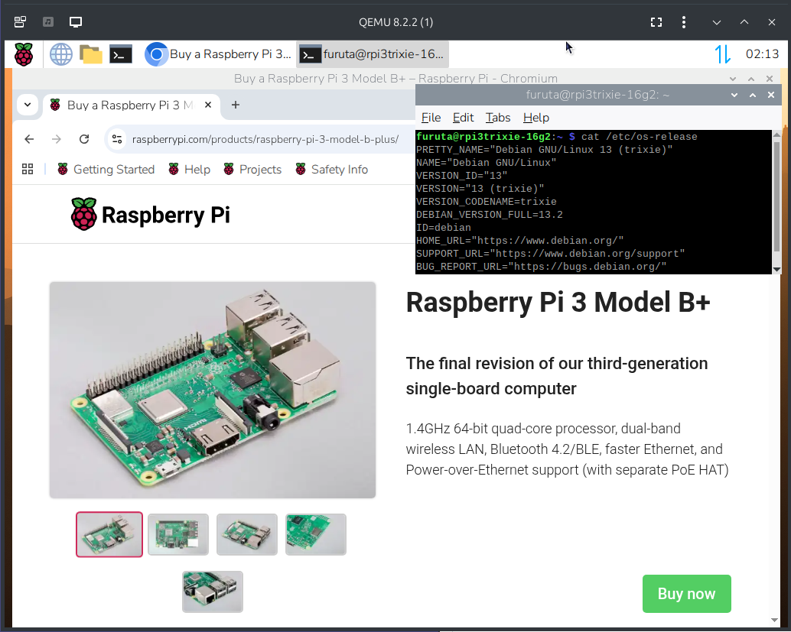

# QEMU 上で RaspberryPi のイメージファイルを動かすまでにすること

## はじめに

Linux PC 上で QEMU を使って RaspberyPi のイメージを動かすことができるまでを目標に設定、知っておいた方が良いことをまとめていくリポジトリを作る予定です。

順次書き足していく予定です。構成の見直しでリンクが大幅に変わる可能性もあります。

## Follow Debian 13 (trixie) release Working in progress

Now working in progress on branch `follow-trixie`. To checkout branch `follow-trixie`.

```bash
# Install required packages.
sudo apt install git bridge-utils uml-utilities \
 qemu-system-common qemu-system qemu-system-arm qemu-utils \
 parted nbd-client cloud-guest-utils e2fsprogs virt-viewer \
 device-tree-compiler gawk
# Clone git repository.
git clone https://github.com/Akinori-Furuta/qemu-raspberrypi.git
cd qemu-raspberrypi
# Checkout branch working with Trixie release.
git branch -t follow-trixie origin/follow-trixie
git checkout follow-trixie
# Setup symbolic links to scripts.
./setup-rpi3-trixie-64.sh
# Attach Raspberry Pi OS image media to PC.
# Find Raspberry Pi OS image media.
./rpi3image.sh find
# Convert Raspberry Pi OS image media into eMMC image file.
./rpi3image.sh /dev/sdX
# 1st step configuration.
./rpi3vm64-1st.sh
# Configure Raspberry Pi OS on GUI.
# Launch Desktop, then logout and shutdown.
# Terminate QEMU [CTRL]-[a] [x] after power off
#  (may be kernel panic).
# 2nd step configuration.
./rpi3vm64-2nd.sh
# Wait until halt.
# Terminate QEMU [CTRL]-[a] [x] after halt.
# Normal operation boot.
./rpi3vm64.sh
# Terminate QEMU [CTRL]-[a] [x] after power off (may be kernel panic).
```

Currently, the Raspberry Pi OS "trixie" graphical desktop runs on QEMU.




> [!note]
> There are some restrictions on QEMU emulator.
>
> * Disable watchdog timer.
>   * Also it disables shutdown driver.
>     When you shutdown Raspberry Pi OS on QEMU,
>     exit QEMU by typing
>     **[Ctrl]-[a]**, **[x]** (QEMU monitor control
>     type in sequence to exit) at monitor terminal.
> * Disable Bluetooth interface via serial port.
> * Disable Wifi device on SDIO bus.
>   * Also disable SDIO contoller which connected to
>     the WiFi device.
> * Fix graphical screen resolution to 1024x768.
>

## 目次

+ [Network Bridge を QEMU 向けに構成する](jp/bridge.md)
+ [QEMU で実行する Rasiberry Pi イメージファイルをスクリプトを使って作る](jp/rpi-image-script.md)
  + [QEMU で実行する Rasiberry Pi イメージファイルを作る (お勧めしませんが手作業でする場合はこちらを参照して下さい)](jp/rpi-image.md)
+ Raspberry Pi OS の初期設定を行う
  + [32bit OS の場合](jp/config-rpi.md)
  + [64bit OS の場合](jp/config-rpi-64.md)
+ [apt upgrade をした後の対応](jp/follow-upgrade.md)

github 上で文書を書いていく練習も兼ねています。物足りなさや記述の稚拙さがあると思います。


