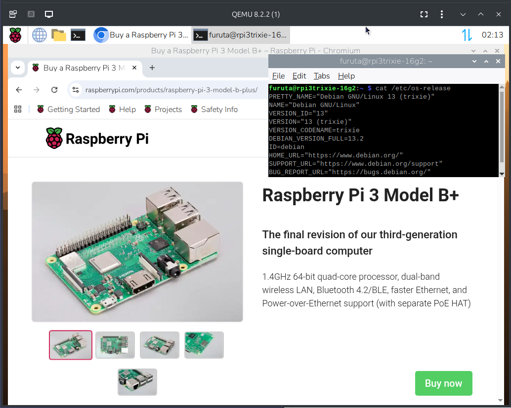

# Run Raspberry Pi OS on QEMU Emulator

## Introduction

This repository contains scripts and driver to run
Raspberry Pi OS Trixie 64bit[^1] on Linux QEMU emulator.

[^1]: 32bit version is supported experimentally.

The following table shows Requirements.

### Host Machine Requirements

|Item|Requires|Note|
|----|--------|----|
|CPU cores|>= 4C/4T[^2]|>=8 threads (better)|
|CPU bits|64||
|CPU clock|>= 3.0GHz|Using a i5-4440 4C/4T 3.1GHz host CPU, the host CPU load achieves 40-60% when running a terminal on the GUI desktop.|
|Memory|>= 6Gibytes|A process emulating Raspberry Pi OS uses 4.4Gibytes.|
|Storage size|>= MediaSize+|At one virtual machine, see [Appendix](#appendix-required-free-storage-size)|
|OS|Ubuntu 24.04 or later|Include delivered distributions, need QEMU 8.2.2 or later version package|

[^2]: nC/mT = n Cores, m Threads

### Bootable Raspberry Pi OS Image Requirements

|Item|Requires|Note|
|----|--------|----|
|Media|SD, Micro SD, USB thumb Memories, and Removable drives|Create a bootable Raspberry Pi OS image|
|Media size|> 8Gbytes|Raspberry Pi OS files uses 6Gbytes space|

## Index

### Run 64bit Raspberry Pi OS Trixie

Following list shows steps to run Raspberry Pi OS Trixie 64bit on
QEMU emulator.

* (Optional) [Network Settings (link to other page)](./en/bridge.md)
  * If you want use networks directory from QEMU virtual machines,
    [setup a bridge (TAP) in Linux Kernel network layer](./en/bridge.md).
    Otherwise (skip network settings), virtual machines connect
    netowork via NAT (called "user mode").
* [Create a Image Media (link to other page)](./en/pi-imager.md)
  * Use the [Raspberry Pi Imager](https://www.raspberrypi.com/software/)
* [Install Required Packages](#install-required-packages)
* [Clone Git Repository](#clone-git-repository)
* [Copy Image From Bootable Media](#copy-image-from-bootable-media)
  * Requires root (privileged) account
* [Initial Setup](#raspberry-pi-os-initial-setup)
  * Run virtual machine twice
    * Setup host name, account, and initial services.
    * Setup a dkms driver to run on QEMU emulator.
* [Run Normally](#run-normally)
* [After Updating Kernel](#after-updating-kernel)
  * Reflect updated kernel and initramfs image files to
    host files.

### Run 32bit Raspberry Pi OS Trixie

If you are interested in running 32bit version of Raspberry Pi OS,
follow link to
[Run Raspberry Pi OS trixie 32bit on emulated Raspberry Pi 2 model B](./readme-trixie32.md).

## Install Required Packages

To install required packages, run following command.

```bash
sudo apt install git bridge-utils uml-utilities \
 qemu-system-common qemu-system qemu-system-arm qemu-utils \
 qemu-system-modules-spice \
 parted nbd-client cloud-guest-utils e2fsprogs virt-viewer \
 device-tree-compiler gawk fatcat gzip binutils diffutils
```

## Clone Git Repository

Clone git repository from github.

```bash
git clone https://github.com/Akinori-Furuta/qemu-raspberrypi.git
cd qemu-raspberrypi
```

Setup symbolic links to scripts.

```bash
./setup-rpi3-trixie-64.sh
```

## Copy Image From Bootable Media

Attach a Raspberry Pi OS image media to PC.
Find Raspberry Pi OS image media path.

```bash
./rpi3image.sh find
# You may be requested your password to acquire root privilege.
[sudo] password for YourLoginId: 
```

You will get the path to Raspberry Pi OS image media as follows,

```text
rpi3image.sh: INFO: Found Raspberry Pi OS image media at "/dev/sdb".
rpi3image.sh: INFO: DEV_PATH="/dev/sdb"
rpi3image.sh: INFO: /dev/sdb.VENDOR="JMicron "
rpi3image.sh: INFO: /dev/sdb.MODEL="Generic         "
rpi3image.sh: INFO: /dev/sdb.SIZE=14.9Gi/16.0G bytes
```

> The above example output says the path to media is /dev/sdb.

Convert the Raspberry Pi OS image media into an eMMC/SDCard
image file. Replace the block device node `/dev/sdX` with
the node which is attached Raspberry Pi OS image media.

```bash
./rpi3image.sh /dev/sdX
```

## Raspberry Pi OS Initial Setup

### First Step

Run Raspberry Pi OS first initial setup in a QEMU virtual machine.

```bash
./rpi3vm64-1st.sh
```

Wait until done configuration process.

> [!TIP]
> You will see `login:` prompt, but leave it. Do not login.

You will see reboot kernel log as follows,

```text
[  OK  ] Reached target reboot.target - System Reboot.
[ 1175.220219] reboot: Restarting system
[ 1175.228158] Reboot failed -- System halted
```

Type **[CTRL]-[a]** **[x]** to terminate the QEMU emulator.

### Second Step

Run second step configuration.

```bash
./rpi3vm64-2nd.sh
```

Login to Raspberry Pi on the QEMU console/monitor terminal.
Use Username and Password customized at Raspberry Pi Imager
as _PiUserName_ and _PiUserPassword_.

```text
Debian GNU/Linux 13 PiHostName ttyAMA1

My IP address is 10.0.2.15 fec0::30cb:bc27:a7a3:5e9a

PiHostName login: PiUserName
Password: PiUserPassword
```

Run the post setup and shutdown on the QEMU console/monitor terminal.

```bash
sudo /var/local/post-setup.sh
sudo /sbin/init 0
```

> [!NOTE]
> [post-setup.sh](./downloads/target/var/local/post-setup.sh)
> does following setups,
>
> * Disable ModemManager.service.
> * Disable rpi-eeprom-update.service.
> * Install power-off and reboot dkms driver bcm2835_power_off.
> * Disable ModemManager.service.
> * Disable rpi-eeprom-update.service.

## Run Normally

Now, ready to run the Raspberry Pi OS on the QEMU emulator.

```bash
./rpi3vm64.sh
```

Currently, the Raspberry Pi OS "trixie" graphical desktop
runs on QEMU.



> [!NOTE]
> There are some restrictions on QEMU emulator.
>
> * Disable watchdog timer.
> * Disable Bluetooth interface via serial port.
> * Disable Wifi device on SDIO bus.
>   * Also disable SDIO contoller which connected to
>     the WiFi device.
> * Fix graphical screen resolution to 1024x768.
> * Disable rpi-eeprom-update.service
> * Disable virtgpio driver

To exit Raspberry Pi OS emulation,type command described in
following table.

|Command|qemu-system-aarch64 option|Action|kernel sequence|
|---|---|---|---|
|/sbin/init 0||Terminate|power off|
|/sbin/reboot|-no-reboot ([rpi3vm64.sh](./downloads/host/rpi3vm64.sh) default)|Terminate|reboot|
|/sbin/reboot|without -no-reboot|Reboot|reboot|

## After Updating Kernel

After updating kernel in emulated Raspberry Pi OS,
exit the QEMU emulation and run following command
on the host PC.

```bash
./rpi3vm64-upkernel.sh
```

[`./rpi3vm64-upkernel.sh`](./downloads/host/rpi3vm64-upkernel.sh)
updates bootfs/kernel8.img and bootfs/initramfs8 by following steps.

* Extract bootfs (/boot/firmware) partition from the
  SDCard/eMMC ($SDFile) image.
* Copy kernel8.img and initramfs8 files from the extracted
  partition to temporary files.
* Compare current kernel8.img and initramfs8 under host
  bootfs/ directory with the temporary files extracted above.
  * If compared files are same to the temporary files,
    do nothing and exit.
* Backup current kernel8.img and initramfs8.
  * The _$(uname -r)_ string is picked from current kernel8.img.
  * Copy the kernel8.img to kernel8-_$(uname -r)_.img.
  * Copy the initramfs8 to initramfs8-_$(uname -r)_.img.
* Move the temporary files to kernel8.img and initramfs8.
  * If failed moving, try revert kernel8.img and initramfs8.

## Appendix: Required Free Storage Size

The "Storage size" consists of Sum of File sizes they are needed
to boot Raspberry Pi OS. These Files are,

* eMMC(Bootable SD card) image file
  * Initial: More than the size of bootable media size
    which is created by Raspberry Pi Imager
    * Its size is round up to 2^i GiBytes { i | Positive Integer }
      * It may becomes 8Gi, 16Gi, 32Gi, ... bytes
  * Recommend use "`raw`" format,
    using "`qcow`", or "`qcow2`" formats results poor performance.
  * On some smart file systems they support sparse file,
    or compressed store, actual file size on storage device may be
    smaller than file size.
* Files in bootfs
  * Kernel, and Initramfs files
    * Initial: 63Mibytes
    * Gains: +32Mibytes at every kernel updates
      * These files are will be updated and kept backup files.
  * Other files
    * Initial: 26Mibytes
* Files in .git
  * Initial: 4Mibytes
* Files scritps and settings
  * Initial: 300kibytes
* Document and misc files
  * Initial: 4Mibytes
