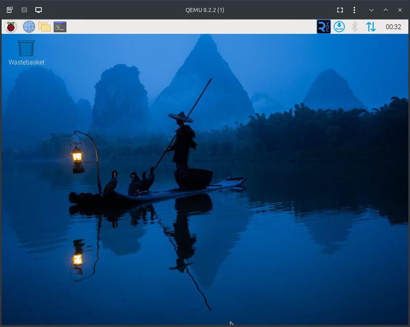

# QEMU 上で RaspberryPi のイメージファイルを動かすまでにすること

## はじめに

Linux PC 上で QEMU を使って RaspberyPi のイメージを動かすことができるまでを目標に設定、知っておいた方が良いことをまとめていくリポジトリを作る予定です。

順次書き足していく予定です。構成の見直しでリンクが大幅に変わる可能性もあります。

## Follow Debian 13 (trixie) release Working in progress

Now working in progress on branch `follow-trixie`. To checkout branch `follow-trixie`.

```bash
git branch -t follow-trixie origin/follow-trixie
git checkout follow-trixie
```

Currently, the Raspberry Pi OS "trixie" runs on QEMU console mode.


To boot the "trixie" anyway. Disable "watchdog" by modifying device tree as follows.

```diff
"${PATCH}" "${DtRpi3BNameQemuSource}" << EOF
--- bcm2710-rpi-3-b.dts	2025-11-19 23:06:31.189266841 +0900
+++ bcm2710-rpi-3-b-qemu.dts	2025-11-20 01:50:14.622630538 +0900
@@ -567,7 +567,7 @@
 				shutdown-gpios = <0x0b 0x00 0x00>;
 				local-bd-address = [00 00 00 00 00 00];
 				fallback-bd-address;
-				status = "okay";
+				status = "disabled";
 				phandle = <0x3a>;
 			};
 		};
@@ -876,6 +876,7 @@
 			clocks = <0x08 0x15 0x08 0x1d 0x08 0x17 0x08 0x16>;
 			clock-names = "v3d\0peri_image\0h264\0isp";
 			system-power-controller;
+			status = "disabled";
 			phandle = <0x2c>;
 		};
 
@@ -1002,6 +1003,7 @@
 			wifi@1 {
 				reg = <0x01>;
 				compatible = "brcm,bcm4329-fmac";
+				status = "disabled";
 				phandle = <0x8a>;
 			};
 		};
EOF
```

> [!note]
> The diff source above contains following changes,
>
> * Disable Bluhtooth interface via serial port.
> * Disable watchdog timer.
>   * Also disables shutdown driver. So, shutdown, then exit QEMU by typing **[Ctrl]-[a]**, **[x]** (QEMU monitor control type in sequence to exit) at monitor terminal.
> * Disable Wifi device on SDIO bus.

## 目次

+ [Network Bridge を QEMU 向けに構成する](jp/bridge.md)
+ [QEMU で実行する Rasiberry Pi イメージファイルをスクリプトを使って作る](jp/rpi-image-script.md)
  + [QEMU で実行する Rasiberry Pi イメージファイルを作る (お勧めしませんが手作業でする場合はこちらを参照して下さい)](jp/rpi-image.md)
+ Raspberry Pi OS の初期設定を行う
  + [32bit OS の場合](jp/config-rpi.md)
  + [64bit OS の場合](jp/config-rpi-64.md)
+ [apt upgrade をした後の対応](jp/follow-upgrade.md)

github 上で文書を書いていく練習も兼ねています。物足りなさや記述の稚拙さがあると思います。


